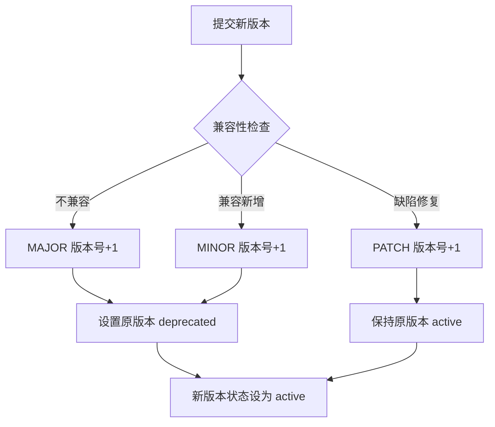
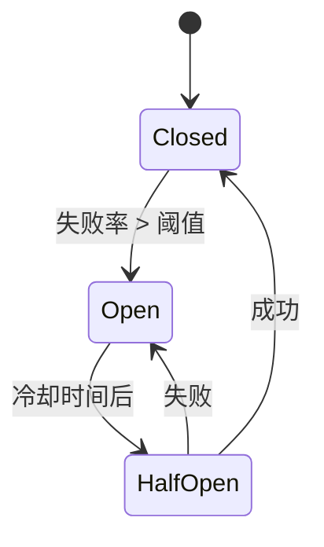
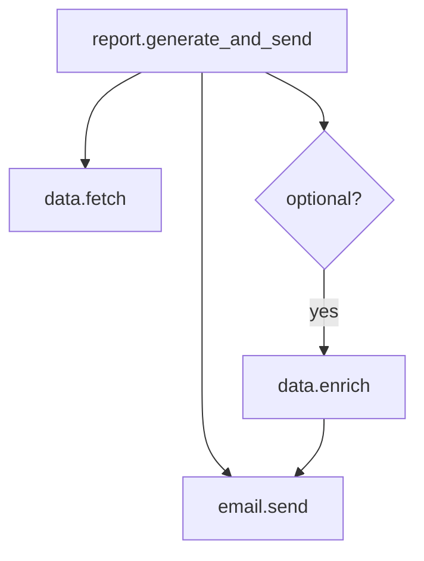
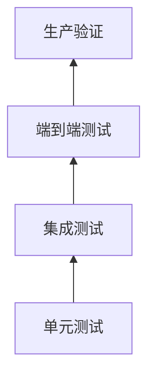

# 从对话到自动化流程：一个准确、稳定、可靠的智能体系统设计文档

| 项目 | 信息 |
|------|------|
| 版本 | 1.4 |
| 日期 | 2026-04-16 |
| 作者 | AI 系统设计团队 |

---

## 更新记录

### v1.4 (2026-04-16)

**新增功能：**
- 模式切换机制：支持 tool-use 和 code-plan 两种工作模式
- 命令行选项：`--mode` 指定启动模式
- 聊天命令：`/mode` 显示/切换工作模式

**架构更新：**
- 在 LLMConfig 中添加 mode 字段
- 聊天命令处理器支持模式切换
- 配置文件支持模式持久化

### v1.3 (2026-04-15)

**新增功能：**
- 百度搜索工具集成：支持使用百度搜索 API 进行中文网络聊天
- 详细日志记录：LLM 请求/响应完整日志，支持 DEBUG 级别
- ImmediateFlushFileHandler：确保日志实时写入磁盘，便于调试

**配置更新：**
- 日志默认级别改为 DEBUG（开发环境）
- config.json 中添加百度搜索 API 密钥配置
- VS Code 设置：.log 文件自动换行

**修复：**
- 百度搜索 API 调用方式更新为正确的端点和格式

---

## 0. 实施方案与技术选型（已确认）

### 0.1 交互模式
- **CLI 模式**：使用 Typer 构建命令行界面
- **工作模式**：支持 tool-use 和 code-plan 两种模式，可通过 `--mode` 选项和 `/mode` 命令切换

### 0.2 LLM 提供商
- **NVIDIA NIM API**：OpenAI 兼容格式
- **环境变量**：`NVIDIA_API_KEY`
- **模型发现**：启动时调用 `/v1/models` 端点动态获取可用模型

### 0.3 模型选择策略
- **模型类型**：仅选择 `chat` 类型模型
- **评分函数**：综合计算模型得分，选取 Top 5
- **Fallback 机制**：按评分顺序自动降级

**评分函数规则**：

```
总分 = 基础分 + 参数大小分 + 系列分 + 后缀加分
```

| 评分项 | 分值 | 说明 |
|--------|------|------|
| 基础分 | 1000 | 仅 chat 模型获得，非 chat 模型 0 分 |
| 参数大小 | 0-100 | 70B+/72B+ → 100, 8x22B → 90, 32B → 80, 8x7B/13B → 70, 8B → 60, 7B → 50 |
| 模型系列 | 0-50 | deepseek/glm → 42, qwen → 40, minimax → 38, llama/mistral/gemma → 35, other → 20 |
| 后缀加分 | 20 | 名称包含 `instruct` 或 `chat` |

**模型系列优先级**：`deepseek` = `glm` > `qwen` > `minimax` > `llama` = `mistral` = `gemma` > `other`

### 0.4 向量嵌入
- **本地 GGUF 模型**：`hf_KimChen_bge-m3-q4_k_m.gguf`
- **向量数据库**：SQLite + sqlite-vec

### 0.5 实现范围
- **完整实现**：需求文档全部 17 个章节，不分阶段

---

## 1. 背景与目标

### 1.1 业务需求

设计并开发一个智能体系统，能够根据会话历史和当前用户提示词，自动生成可执行的自动化处理流程。该流程必须由程序准确、稳定、可靠地运行，满足生产环境要求。

### 1.2 核心挑战

- 任务复杂多变，可能包含多步骤、条件分支、循环、错误处理等逻辑。
- 需要整合大量预定义工具（可能成百上千个），每个工具都有明确的输入输出和安全约束。
- 必须保证运行时确定性和可审计性，避免大模型的随机性导致流程不可预测。

### 1.3 关键原则

工具是基础设施，由开发团队预先构建、测试和审计。运行时智能体只选择与编排已有工具，绝不动态创建或修改工具。

- 大模型用于意图理解、工具检索和流程规划，不用于实际执行底层逻辑。
- 大模型用于工具调用，统一使用 tool calling 这个事实的工业标准。
- 生成后的流程固化运行，不再依赖大模型。

---

## 2. 现有方案评估与不足

| 方案 | 优点 | 不足 |
|------|------|------|
| 单步 Tool Calling（如 OpenAI function calling） | 简单、标准 | 无法处理多步骤、条件循环等复杂逻辑 |
| ReAct 动态编排 | 灵活，适应未知任务 | 多次 LLM 调用，成本高，结果不确定 |
| Plan-and-Execute (DAG) | 执行图确定，可观测 | 表达能力受限（条件/循环需特殊节点），且仍可能依赖运行时 LLM |
| Coding Agent 生成代码 | 理论图灵完备，表达力强 | 代码不可靠、难复用、浪费 token，已被实践证实不适合生产 |
| Skill 自然语言流程 | 语义清晰 | 执行仍依赖大模型，不确定性未解决 |
| DSL/宏语言 | 可控 | 需设计新语法，LLM 生成和解析成本高 |

**结论**：需要一种结合 LLM 规划能力与确定性执行引擎的混合架构，且必须解决大规模工具集的管理问题。

---

## 3. 核心设计理念

### 3.1 确定性执行优先

自动化流程由 Python 代码结合工具调用实现，图灵完备。

运行时不再调用 LLM，仅由执行引擎驱动。

**设计原则：工具优先，但保留灵活性**
- 优先使用已注册工具完成系统资源访问（文件、网络、进程等）
- 生成的 Python 代码用于**工具流程编排和逻辑处理**
- 代码也可直接使用 Python 标准库进行数据处理和系统操作
- 所有操作完整记录审计日志，便于追溯和调试

### 3.2 工具注册中心 (Tool Registry) 管理大规模工具集

所有原子工具（weather, email, db query, http request 等）统一注册到本地 Tool Registry。

注册信息包含：名称、描述、输入输出 JSON Schema、调用端点、安全标签等。

### 3.3 两阶段 LLM 调用（针对超大工具集）

**第一阶段**：加载 `direct`（直接回答）、`find_tools`（工具检索）两个元工具，以及 `search.web`（网络搜索）工具（高频使用）。

**第二阶段**：加载第一阶段筛选出的原子工具，以及 `coding_tool_use`（复杂逻辑后备）和 `step_down`（降级处理）。

> 若工具集规模可控（<50），可合并为单阶段调用。

---

## 4. 系统架构

### 4.1 总体模块

```
[用户输入] → [上下文管理器] → [两阶段调度器]
                                   ├─ 第一阶段 (轻量路由)
                                   │     ├─ direct
                                   │     ├─ find_tools → [Tool Registry]
                                   │     └─ search.web (高频工具)
                                   │
                                   └─ 第二阶段 (规划器)
                                         ├─ coding_tool_use
                                         └─ step-down (后备)

[确定性执行（Python）] → [结果] → [回复生成]
```

### 4.2 模块说明

#### 4.2.1 上下文管理器

- 维护会话历史，裁剪过长的历史。
- 注入系统提示词（角色、安全边界等）。

#### 4.2.2 两阶段调度器

##### 第一阶段

调用 LLM，提供 `direct`、`find_tools` 两个元工具，以及 `search.web` 工具（高频使用）。

- 若 LLM 选择 `direct`，直接生成最终回复。
- 若选择 `find_tools`，解析参数（如查询关键词），调用 Tool Registry 检索工具列表。

**元工具定义 - `direct`**

```json
{
  "name": "direct",
  "description": "直接生成自然语言回复，不调用任何工具",
  "parameters": {
    "type": "object",
    "properties": {
      "response": {
        "type": "string",
        "description": "给用户的自然语言回复内容"
      }
    },
    "required": ["response"]
  }
}
```

**元工具定义 - `find_tools`**

```json
{
  "name": "find_tools",
  "description": "根据用户需求检索相关工具",
  "parameters": {
    "type": "object",
    "properties": {
      "query": {
        "type": "string",
        "description": "描述用户需要什么功能的自然语言，例如：获取天气、发送邮件"
      }
    },
    "required": ["query"]
  },
  "returns": {
    "type": "array",
    "items": {
      "type": "object",
      "properties": {
        "tool_id": {"type": "string"},
        "name": {"type": "string"},
        "description": {"type": "string"},
        "similarity_score": {"type": "number"}
      }
    }
  }
}
```

##### 第二阶段

将检索到的工具定义（完整 Schema）与用户问题、会话历史一同送入 LLM。

**可用工具**：
1. 第一阶段检索到的普通工具（可直接调用）
2. 高频工具：`search.web`（始终可用）
3. 元工具：`coding_tool_use`、`step_down`

**工具选择策略**：
- **简单逻辑**：直接使用 Tool Calling 调用检索到的普通工具（单工具或简单顺序多工具）
- **复杂逻辑**（多步骤、条件分支、循环）：使用 `coding_tool_use`，生成 Python 的流程代码执行
- 无合适工具或其他情景：使用 `step_down` (降级处理)

**简单逻辑判断标准**：
- 单个工具调用，无需后续处理
- 多个工具顺序调用，无分支、无条件、无循环
- 工具输出直接作为最终结果，或仅需简单拼接

**数据传递说明**：
第一阶段 `find_tools` 返回的工具列表，将作为第二阶段 LLM 的可用工具集合传入。每个工具的完整 JSON Schema 都会提供给 LLM。

**元工具定义 - `coding_tool_use`**

```json
{
  "name": "coding_tool_use",
  "description": "生成Python代码来编排多个工具的执行（支持条件、循环等复杂逻辑）。优先使用已注册工具，也可使用Python标准库进行数据处理。",
  "parameters": {
    "type": "object",
    "properties": {
      "code": {
        "type": "string",
        "description": "Python代码字符串，可调用已注册工具，也可使用Python标准库"
      }
    },
    "required": ["code"]
  }
}
```

**元工具定义 - `step_down`**

```json
{
  "name": "step_down",
  "description": "当无法通过工具完成任务时，降级为人工友好的回复",
  "parameters": {
    "type": "object",
    "properties": {
      "reason": {
        "type": "string",
        "enum": ["no_matching_tools", "too_complex", "safety_concern", "user_confirmation_required"]
      },
      "message": {
        "type": "string",
        "description": "给用户的解释信息"
      }
    },
    "required": ["reason", "message"]
  }
}
```

**降级策略**

| 原因 | 用户反馈 |
|------|----------|
| `no_matching_tools` | 告知用户暂无此功能，建议替代方案 |
| `too_complex` | 建议用户拆分为多个简单步骤 |
| `safety_concern` | 需要用户明确确认后再执行 |
| `user_confirmation_required` | 列出将要执行的操作，等待用户确认 |

#### 4.2.3 Tool Registry

嵌入式数据库 SQLite + 向量索引。

**向量检索技术栈**

- Embedding 模型：`hf_KimChen_bge-m3-q4_k_m.gguf`（GGUF 量化格式）
- 向量数据库：sqlite-vec（SQLite 向量检索扩展）
- 相似度算法：余弦相似度

提供注册、检索、更新工具。支持按类别、关键词、向量相似度检索。

**内置元工具**

以下元工具必须预先注册到 Tool Registry，由系统内部实现：

| 工具 ID | 名称 | 类型 | 说明 |
|---------|------|------|------|
| `meta.direct` | direct | 元工具 | 直接生成自然语言回复，不调用任何工具 |
| `meta.find_tools` | find_tools | 元工具 | 根据用户需求检索相关工具 |
| `meta.coding_tool_use` | coding_tool_use | 元工具 | 生成 Python 代码编排工具执行 |
| `meta.step_down` | step_down | 元工具 | 降级处理，返回人工友好的提示 |

**高频预置工具**

以下工具为高频使用，在第一阶段直接加载：

| 工具 ID | 名称 | 类型 | 说明 |
|---------|------|------|------|
| `search.web` | web_search | 普通工具 | 通用网络搜索工具，自动选择合适的搜索引擎 |

**工具执行类型**

支持以下主流工具执行方式：

| 类型 | 说明 | 适用场景 |
|------|------|----------|
| `function` | Python 函数调用 | 本地 Python 代码 |
| `cli` | 命令行程序调用 | 外部可执行程序 |
| `skill` | 预置技能/工作流 | 多步骤组合流程 |
| `http` | HTTP 服务调用 | 远程 API 服务 |
| `mcp` | Model Context Protocol | MCP 标准工具 |

**工具注册数据模型 - HTTP 示例**

```json
{
  "id": "weather.get",
  "name": "get_weather",
  "description": "获取指定城市的当前天气",
  "parameters": {
    "type": "object",
    "properties": {
      "city": {"type": "string"}
    },
    "required": ["city"]
  },
  "execution": {
    "type": "http",
    "endpoint": "http://weather-service/current",
    "method": "GET"
  },
  "security": ["readonly", "no_side_effects"],
  "metadata": {
    "category": "utilities",
    "tags": ["weather", "forecast"],
    "version": "1.0.0"
  }
}
```

**工具注册数据模型 - Python Function 示例**

```json
{
  "id": "math.calculate",
  "name": "calculate",
  "description": "执行数学计算",
  "parameters": {
    "type": "object",
    "properties": {
      "expression": {"type": "string"}
    },
    "required": ["expression"]
  },
  "execution": {
    "type": "function",
    "module": "my_tools.math",
    "function": "evaluate"
  },
  "security": ["readonly", "no_side_effects"],
  "metadata": {
    "category": "utilities",
    "tags": ["math", "calculation"],
    "version": "1.0.0"
  }
}
```

**工具注册数据模型 - CLI 示例**

```json
{
  "id": "file.list",
  "name": "list_files",
  "description": "列出目录下的文件",
  "parameters": {
    "type": "object",
    "properties": {
      "path": {"type": "string"}
    },
    "required": ["path"]
  },
  "execution": {
    "type": "cli",
    "command": "ls",
    "args": ["-la", "{path}"],
    "timeout": 30
  },
  "security": ["readonly"],
  "metadata": {
    "category": "filesystem",
    "tags": ["file", "directory"],
    "version": "1.0.0"
  }
}
```

**工具注册数据模型 - Skill 示例**

```json
{
  "id": "report.generate_and_send",
  "name": "generate_and_send_report",
  "description": "生成报告并发送邮件",
  "parameters": {
    "type": "object",
    "properties": {
      "report_type": {"type": "string"},
      "recipient": {"type": "string"}
    },
    "required": ["report_type", "recipient"]
  },
  "execution": {
    "type": "skill",
    "skill_id": "builtin.report_workflow"
  },
  "security": ["readwrite"],
  "metadata": {
    "category": "workflows",
    "tags": ["report", "email"],
    "version": "1.0.0"
  }
}
```

**工具注册数据模型 - MCP 示例**

```json
{
  "id": "browser.navigate",
  "name": "navigate",
  "description": "在浏览器中打开指定 URL",
  "parameters": {
    "type": "object",
    "properties": {
      "url": {"type": "string"}
    },
    "required": ["url"]
  },
  "execution": {
    "type": "mcp",
    "server": "mcp.config.usrlocalmcp.browser-tools",
    "tool": "puppeteer_navigate"
  },
  "security": ["readwrite"],
  "metadata": {
    "category": "browser",
    "tags": ["web", "navigation"],
    "version": "1.0.0"
  }
}
```

**预置搜索工具**

以下搜索工具需预先注册到 Tool Registry：

**Serper Search 工具**

```json
{
  "id": "search.serper",
  "name": "serper_search",
  "description": "使用 Serper API 进行网络搜索，获取网页摘要和链接",
  "parameters": {
    "type": "object",
    "properties": {
      "query": {
        "type": "string",
        "description": "搜索关键词或问题"
      },
      "num": {
        "type": "integer",
        "description": "返回结果数量，默认 10",
        "default": 10
      }
    },
    "required": ["query"]
  },
  "execution": {
    "type": "http",
    "endpoint": "https://google.serper.dev/search",
    "method": "POST",
    "headers": {
      "X-API-KEY": "${SERPER_API_KEY}",
      "Content-Type": "application/json"
    }
  },
  "security": ["readonly", "external_api"],
  "metadata": {
    "category": "search",
    "tags": ["web", "search", "serper"],
    "version": "1.0.0"
  }
}
```

**Tavily Search 工具**

```json
{
  "id": "search.tavily",
  "name": "tavily_search",
  "description": "使用 Tavily API 进行 AI 增强的网络搜索，支持深度搜索和答案提取",
  "parameters": {
    "type": "object",
    "properties": {
      "query": {
        "type": "string",
        "description": "搜索关键词或问题"
      },
      "search_depth": {
        "type": "string",
        "enum": ["basic", "advanced"],
        "description": "搜索深度，默认 basic",
        "default": "basic"
      },
      "include_answer": {
        "type": "boolean",
        "description": "是否包含 AI 生成的答案",
        "default": true
      },
      "max_results": {
        "type": "integer",
        "description": "返回结果数量，默认 5",
        "default": 5
      }
    },
    "required": ["query"]
  },
  "execution": {
    "type": "http",
    "endpoint": "https://api.tavily.com/search",
    "method": "POST",
    "headers": {
      "Authorization": "Bearer ${TAVILY_API_KEY}",
      "Content-Type": "application/json"
    }
  },
  "security": ["readonly", "external_api"],
  "metadata": {
    "category": "search",
    "tags": ["web", "search", "tavily", "ai"],
    "version": "1.0.0"
  }
}
```

**Baidu Search 工具**

```json
{
  "id": "search.baidu",
  "name": "baidu_search",
  "description": "使用百度搜索 API 进行中文网络搜索",
  "parameters": {
    "type": "object",
    "properties": {
      "query": {
        "type": "string",
        "description": "搜索关键词或问题"
      },
      "pn": {
        "type": "integer",
        "description": "起始结果页码，默认 0",
        "default": 0
      },
      "rn": {
        "type": "integer",
        "description": "每页结果数量，默认 10",
        "default": 10
      }
    },
    "required": ["query"]
  },
  "execution": {
    "type": "http",
    "endpoint": "https://sp0.baidu.com/5a1Fazu8AA54nxGko9WTAnF6hhy/su",
    "method": "GET"
  },
  "security": ["readonly", "external_api"],
  "metadata": {
    "category": "search",
    "tags": ["web", "search", "baidu", "chinese"],
    "version": "1.0.0"
  }
}
```

**Web Search 工具（统一接口）**

```json
{
  "id": "search.web",
  "name": "web_search",
  "description": "通用网络搜索工具，自动选择合适的搜索引擎进行搜索",
  "parameters": {
    "type": "object",
    "properties": {
      "query": {
        "type": "string",
        "description": "搜索关键词或问题"
      },
      "num_results": {
        "type": "integer",
        "description": "返回结果数量，默认 5",
        "default": 5
      },
      "engine": {
        "type": "string",
        "enum": ["auto", "serper", "tavily", "baidu"],
        "description": "指定搜索引擎，auto 表示自动选择",
        "default": "auto"
      },
      "language": {
        "type": "string",
        "description": "搜索结果语言偏好，例如 zh-CN、en-US",
        "default": "zh-CN"
      }
    },
    "required": ["query"]
  },
  "execution": {
    "type": "skill",
    "skill_id": "builtin.web_search_router"
  },
  "security": ["readonly", "external_api"],
  "metadata": {
    "category": "search",
    "tags": ["web", "search", "unified"],
    "version": "1.0.0"
  }
}
```

---

## 5. 工作流示例

### 场景一：简单逻辑（直接 Tool Calling）

**用户输入**：
> "查询今天北京的天气"

#### 5.1 第一阶段

系统调用 LLM（direct / find_tools / search.web）。

LLM 输出：find_tools，参数 "获取天气"。

Tool Registry 检索出 weather.get 工具。

#### 5.2 第二阶段

加载检索到的工具，将工具定义 + 用户问题送入 LLM。

LLM 判断为简单单工具任务，**直接调用 get_weather**：

```json
{
  "tool_calls": [
    {
      "id": "call_456",
      "type": "function",
      "function": {
        "name": "get_weather",
        "arguments": "{\"city\": \"北京\"}"
      }
    }
  ]
}
```

执行工具，返回结果给用户。

---

### 场景二：复杂逻辑（coding_tool_use）

**用户输入**：
> "查询今天北京的天气，如果温度超过30度，给我发一封邮件提醒。"

### 5.1 第一阶段

系统调用 LLM（仅 direct / find_tools）。

LLM 输出：find_tools，参数 "获取天气和发送邮件"。

Tool Registry 检索出 weather.get 和 email.send 两个工具。

**LLM 输出示例**

```json
{
  "tool_calls": [
    {
      "id": "call_123",
      "type": "function",
      "function": {
        "name": "find_tools",
        "arguments": "{\"query\": \"获取天气和发送邮件\"}"
      }
    }
  ]
}
```

**Tool Registry 返回示例**

```json
[
  {
    "tool_id": "weather.get",
    "name": "get_weather",
    "description": "获取指定城市的当前天气",
    "similarity_score": 0.95
  },
  {
    "tool_id": "email.send",
    "name": "send_email",
    "description": "发送邮件到指定地址",
    "similarity_score": 0.88
  }
]
```

### 5.2 第二阶段

加载检索到的工具，将两个工具的定义 + 用户问题送入 LLM。

LLM 判断需要条件判断，选择 `coding_tool_use`：

```json
{
  "tool_calls": [
    {
      "id": "call_456",
      "type": "function",
      "function": {
        "name": "coding_tool_use",
        "arguments": {
          "code": "weather = get_weather(city=\"北京\")\nif weather.temperature > 30:\n    send_email(to=\"user@example.com\", subject=\"高温提醒\", body=f\"北京今天温度{weather.temperature}度，超过30度了！\")\nreturn weather"
        }
      }
    }
  ]
}
```

代码执行前先进行语法校验，然后记录执行轨迹。

**代码调用工具机制**：
生成的 Python 代码执行时，所有已注册工具以同名函数形式注入到执行环境中，可直接调用。例如：
- `get_weather(city="北京")` → 调用 `weather.get` 工具
- `send_email(to="...")` → 调用 `email.send` 工具

---

## 6. 两阶段调用的深度讨论

### 6.1 何时需要两阶段？

- 工具总数 > 100 且每个工具定义长度 > 500 字符，导致单次 prompt 无法容纳所有工具。
- 希望完全避免手动分类或关键词匹配，完全由 LLM 驱动工具发现。

**第一阶段可用工具说明**：
- `direct`：直接回答用户问题，无需工具
- `find_tools`：需要使用其他工具时，先检索相关工具
- `search.web`：高频搜索工具，可直接调用，无需第二阶段

### 6.2 两阶段的优缺点

| 优点 | 缺点 |
|------|------|
| 避免上下文过载 | 两次 LLM 调用增加延迟和成本 |
| 工具检索由模型自适应完成 | 第一阶段 find_tools 的检索质量依赖模型 |
| 架构统一（无需外部检索系统） | 状态管理复杂（需传递筛选结果） |

---

## 7. 工具注册中心 (Tool Registry) 实现要点

### 7.1 存储模型

**关系表**：`tools(id, name, description, schema_json, execution_config, security_tags, metadata_json, created_at, updated_at)`

**向量索引**：对 `name + description` 做 embedding，用于语义检索。

### 7.2 集成方式

使用嵌入式库（SQLite + sqlite-vec）。

提供 Python SDK，供智能体系统调用。

注册时记录提交人、审核状态。

---

## 8. 提示词管理设计

### 8.1 技术选型

使用 **Jinja2** 作为提示词模板引擎。

**选型理由**：
- Jinja2 是 Python 生态最成熟的模板引擎，每月下载量超 1 亿次
- 语法简洁强大，支持条件判断、循环、继承等高级特性
- 轻量级，无额外依赖负担
- 所有 Python 开发者都熟悉，学习成本低

### 8.2 模板组织方式

模板文件统一存放于 `prompts/templates/` 目录，使用 `.j2` 扩展名。

**模板文件结构示例**：
```
prompts/
├── __init__.py
├── loader.py          # 提示词加载器
└── templates/
    ├── system_prompt.j2
    ├── phase_one.j2
    ├── phase_two.j2
    └── ...
```

### 8.3 核心功能

**PromptLoader 类**：
- `get_template(template_name)` - 获取模板对象
- `render(template_name, **kwargs)` - 渲染指定模板文件
- `render_string(template_string, **kwargs)` - 渲染模板字符串
- `list_templates()` - 列出所有可用模板

**便捷函数**：
- `render_template(template_string, **kwargs)` - 快速渲染字符串模板

### 8.4 模板设计规范

**常用模板变量**：
- `user_input` - 用户当前输入
- `session_history` - 会话历史
- `tools` - 可用工具列表
- `role` - 助手角色配置

**模板语法示例**：
```jinja2
你是一个智能助手。


你是专业的代码助手。

你是搜索助手。


可用工具：

- {{ tool.name }}: {{ tool.description }}

```

---

## 9. 确定性执行设计补充

### 9.1 可靠性保障

- 每个 tool 执行超时（例如 30s）
- 异常捕获

### 9.2 可观测性

**执行轨迹 Schema**

```json
{
  "trace_id": "uuid",
  "session_id": "uuid",
  "timestamp": "2026-04-14T09:00:00Z",
  "user_input": "查询今天北京的天气...",
  "phase_one": {
    "tool_choice": "find_tools",
    "found_tools": ["weather.get", "email.send"],
    "latency_ms": 1200
  },
  "phase_two": {
    "tool_choice": "coding_tool_use",
    "generated_code": "...",
    "latency_ms": 2500
  },
  "execution": {
    "steps": [
      {
        "step": 1,
        "tool": "weather.get",
        "input": {"city": "北京"},
        "output": {"temperature": 32, "...": "..."},
        "start_time": "2026-04-14T09:00:03Z",
        "end_time": "2026-04-14T09:00:04Z",
        "duration_ms": 800,
        "status": "success"
      },
      {
        "step": 2,
        "tool": "email.send",
        "input": {"to": "user@example.com", "...": "..."},
        "output": {"status": "sent"},
        "start_time": "2026-04-14T09:00:04Z",
        "end_time": "2026-04-14T09:00:05Z",
        "duration_ms": 600,
        "status": "success"
      }
    ],
    "total_duration_ms": 2100,
    "final_status": "completed"
  }
}
```

记录每个步骤的开始、结束、耗时、输入输出。生成执行轨迹 JSON，用于调试和审计。

---

## 10. 安全与稳定性设计

### 10.1 工具调用安全

- 所有原子工具通过 Registry 注册，生成的 Python 代码仅允许调用已注册工具。
- 工具按安全标签分级：`readonly`、`readwrite`、`destructive`
- `destructive` 级别的工具必须经过用户确认才能执行

### 10.2 代码执行环境

**执行环境与安全审计**：

**基本约束**：
- 执行超时控制（默认 30 秒）
- 已注册工具以同名函数形式注入，可直接调用（如 `list_files(path="...")`、`get_weather(city="...")`）
- 所有执行操作记录完整审计日志，包含代码内容、输入输出、执行时长

**代码能力**：
- 可使用 Python 标准库进行数据处理（字符串、列表、字典、日期时间等）
- 可使用条件、循环、异常处理等控制流
- 确有需要时，也可直接使用 Python 标准库（如 `os`、`subprocess`、`requests` 等），但操作会被记录审计

**安全原则**：
- 生产环境建议通过工具封装系统资源访问，便于权限控制和审计
- 敏感操作（删除文件、修改系统配置等）应在工具层面配置安全标签和确认机制
- 代码生成和执行过程支持人工审核介入

### 10.3 审计与日志

- 所有工具调用记录完整输入输出
- 执行轨迹持久化存储
- 支持按用户、时间、工具类型查询历史

---

## 11. 工具版本管理设计

### 11.1 版本标识规范

使用语义化版本（Semantic Versioning）`MAJOR.MINOR.PATCH`：

- **MAJOR**：不兼容的 API 变更
- **MINOR**：向下兼容的功能性新增
- **PATCH**：向下兼容的问题修正

示例：`1.2.3` → 主版本 1，次版本 2，修订版本 3

### 11.2 版本生命周期状态

| 状态 | 说明 | 允许调用 | 允许新注册 |
|------|------|----------|------------|
| `draft` | 草稿状态，开发中 | ❌ | ✅ |
| `active` | 活跃状态，生产可用 | ✅ | ✅ |
| `deprecated` | 已废弃，建议迁移 | ✅（告警） | ❌ |
| `retired` | 已退役，不可用 | ❌ | ❌ |

### 11.3 版本注册与存储

**扩展工具注册数据模型**：

```json
{
  "id": "weather.get",
  "version": "1.2.3",
  "name": "get_weather",
  "description": "获取指定城市的当前天气",
  "parameters": { /* ... */ },
  "execution": { /* ... */ },
  "security": ["readonly"],
  "metadata": {
    "category": "utilities",
    "tags": ["weather"],
    "version": "1.2.3",
    "version_status": "active",
    "changelog": "添加了温度单位参数支持",
    "deprecated_since": null,
    "retirement_date": null,
    "replaces": null,
    "replaced_by": null
  },
  "created_at": "2026-04-01T00:00:00Z",
  "updated_at": "2026-04-14T00:00:00Z"
}
```

### 11.4 多版本共存策略

**版本号在 ID 中的编码**：
- 完整工具标识格式：`{tool_id}@{version}`
- 示例：`weather.get@1.2.3`

**不带版本号的解析规则**：
- `weather.get` → 默认使用 `active` 状态中最新版本
- 可配置默认策略：`latest_active`、`latest`、`specific_version`

### 11.5 版本升级流程

#### 11.5.1 注册新版本



#### 11.5.2 自动迁移策略

**渐进式发布**：
- 灰度发布：新版本先给 10% 流量
- 指标监控：成功率、延迟、错误率
- 自动回滚：异常时自动切回旧版本

**配置示例**：
```json
{
  "rollout_strategy": {
    "type": "percentage",
    "percentage": 10,
    "duration_hours": 24,
    "rollback_on_error_rate": 0.05
  }
}
```

### 11.6 废弃与退役

#### 11.6.1 废弃通知

- 在工具描述中添加废弃警告
- 调用时返回 `DeprecationWarning` 头
- 提前 30 天通知开发者

#### 11.6.2 退役执行

1. 设置状态为 `retired`
2. 拒绝新调用，返回明确错误信息
3. 保留执行历史至少 90 天

---

## 12. 错误处理与重试机制设计

### 12.1 错误分类体系

#### 12.1.1 按错误类型分类

| 错误类别 | 错误码 | 说明 | 是否可重试 |
|----------|--------|------|------------|
| `tool_error` | `TE-001` | 工具执行失败 | 取决于子错误码 |
| `timeout_error` | `TE-002` | 工具执行超时 | ✅ |
| `validation_error` | `VE-001` | 参数验证失败 | ❌ |
| `schema_error` | `VE-002` | 输出不符合 Schema | ❌ |
| `security_error` | `SE-001` | 安全策略拒绝 | ❌ |
| `dependency_error` | `DE-001` | 依赖工具失败 | 级联策略 |
| `registry_error` | `RE-001` | 工具未找到 | ❌ |
| `internal_error` | `IE-001` | 系统内部错误 | ✅ |

#### 12.1.2 按严重程度分类

| 级别 | 说明 | 示例 | 处理方式 |
|------|------|------|----------|
| `fatal` | 系统级故障 | 数据库崩溃 | 立即终止，告警 |
| `error` | 任务失败 | 工具调用失败 | 记录，重试或降级 |
| `warning` | 可容忍问题 | 版本废弃警告 | 记录，继续执行 |
| `info` | 重要信息 | 切换到备用工具 | 记录 |

### 12.2 重试策略设计

#### 12.2.1 重试配置模型

```json
{
  "retry_policy": {
    "max_attempts": 3,
    "backoff_strategy": "exponential",
    "initial_delay_ms": 1000,
    "max_delay_ms": 30000,
    "multiplier": 2,
    "jitter": true,
    "retryable_errors": [
      "timeout_error",
      "internal_error",
      "tool_error.rate_limited"
    ]
  }
}
```

#### 12.2.2 退避策略

| 策略 | 算法 | 说明 |
|------|------|------|
| `fixed` | `delay = initial_delay` | 固定延迟 |
| `linear` | `delay = initial_delay * attempt` | 线性递增 |
| `exponential` | `delay = initial_delay * (multiplier ^ attempt)` | 指数退避 |
| `exponential_with_jitter` | 指数退避 + 随机抖动 | 避免雪崩 |

**推荐默认值**：
- `max_attempts`: 3
- `backoff_strategy`: `exponential_with_jitter`
- `initial_delay_ms`: 1000
- `multiplier`: 2

### 12.3 降级处理策略

#### 12.3.1 降级层级

| 层级 | 触发条件 | 行为 |
|------|----------|------|
| 0 | 正常执行 | 按流程执行 |
| 1 | 非关键工具失败 | 跳过该工具，继续执行 |
| 2 | 主工具失败 | 切换到备用工具 |
| 3 | 所有工具失败 | 返回缓存结果（如有） |
| 4 | 无缓存可用 | 使用 `step_down` 返回友好提示 |

#### 12.3.2 备用工具配置

```json
{
  "fallback_strategy": {
    "primary_tool": "search.tavily",
    "fallback_tools": [
      {
        "tool": "search.serper",
        "on_errors": ["timeout_error", "tool_error.rate_limited"]
      },
      {
        "tool": "search.baidu",
        "on_errors": ["*"]
      }
    ],
    "cache_fallback": {
      "enabled": true,
      "ttl_seconds": 3600
    }
  }
}
```

### 12.4 熔断机制

#### 12.4.1 熔断器状态



#### 12.4.2 熔断器配置

```json
{
  "circuit_breaker": {
    "enabled": true,
    "error_rate_threshold": 0.5,
    "minimum_requests": 10,
    "half_open_timeout_ms": 30000,
    "half_open_max_requests": 3
  }
}
```

### 12.5 告警与监控

#### 12.5.1 关键告警指标

| 指标 | 告警阈值 | 严重程度 |
|------|----------|----------|
| 工具错误率 | > 5% | warning |
| 工具错误率 | > 20% | error |
| 超时率 | > 10% | warning |
| 熔断触发 | 1 次 | warning |
| 系统错误 | 1 次 | error |

#### 12.5.2 执行轨迹中的错误记录

```json
{
  "execution": {
    "steps": [
      {
        "step": 1,
        "tool": "weather.get",
        "attempt": 2,
        "error": {
          "code": "TE-002",
          "message": "Request timeout after 30s",
          "retryable": true
        },
        "retry_history": [
          {
            "attempt": 1,
            "error_code": "TE-002",
            "delay_ms": 1000
          }
        ]
      }
    ]
  }
}
```

---

## 13. 工具依赖关系设计

### 13.1 依赖类型

| 类型 | 说明 | 示例 |
|------|------|------|
| `requires` | 强依赖，必须前置执行 | `report.generate` requires `data.fetch` |
| `optional` | 可选依赖，增强功能 | `chart.render` optional `data.enrich` |
| `conflicts_with` | 互斥，不能同时使用 | `search.tavily` conflicts_with `search.serper` |
| `replaces` | 替代关系 | `weather.v2` replaces `weather.v1` |

### 13.2 依赖声明格式

```json
{
  "id": "report.generate_and_send",
  "name": "generate_and_send_report",
  "dependencies": {
    "requires": [
      {
        "tool_id": "data.fetch",
        "version_constraint": ">=1.0.0,<2.0.0",
        "auto_invoke": true,
        "parameter_mapping": {
          "report_type": "data_type"
        }
      }
    ],
    "optional": [
      {
        "tool_id": "data.enrich",
        "condition": "has_external_data == true"
      }
    ],
    "conflicts_with": [
      "legacy.report_generator"
    ]
  }
}
```

### 13.3 依赖解析与执行

#### 13.3.1 依赖图构建



#### 13.3.2 执行顺序算法

1. 拓扑排序构建有向无环图（DAG）
2. 并行执行无依赖的节点
3. 按依赖顺序串行执行有依赖的节点
4. 可选依赖根据条件动态决定

### 13.4 参数传递与数据流转

#### 13.4.1 参数映射配置

```json
{
  "parameter_mapping": {
    "upstream.tool_id.output_field": "downstream.tool_id.input_field",
    "data.fetch.result.items": "report.generate.data_items",
    "context.session_id": "email.send.tracking_id"
  }
}
```

#### 13.4.2 数据转换

支持简单数据转换表达式：

```json
{
  "transforms": [
    {
      "source": "weather.get.temperature",
      "target": "report.generate.temp_celsius",
      "expression": "source - 273.15"
    },
    {
      "source": "search.web.results",
      "target": "report.generate.sources",
      "expression": "[item.url for item in source[:5]]"
    }
  ]
}
```

### 13.5 循环依赖检测

- 注册时自动检测循环依赖
- 检测到循环依赖拒绝注册
- 提供依赖图可视化工具

---

## 14. 配置管理设计

### 14.1 配置层次结构

```mermaid
flowchart TD
    A[默认配置<br>config.default.yaml] --> B[全局配置<br>config.yaml]
    B --> C[环境配置<br>config.{env}.yaml]
    C --> D[实例配置<br>config.instance.yaml]
```

**优先级**：实例 > 环境 > 全局 > 默认

### 14.2 配置文件结构

#### 14.2.1 主配置文件 `config.yaml`

```yaml
# 系统基本配置
system:
  name: qd-agents
  version: "1.0.0"
  environment: development  # development / staging / production

# LLM 配置
llm:
  default_provider: doubao
  providers:
    doubao:
      api_key: "${DOUBAO_API_KEY}"
      base_url: "https://ark.cn-beijing.volces.com/api/v3"
      model: "doubao-seed-2.5-thinking"
      timeout: 120000
      max_retries: 3
      
    openai:
      api_key: "${OPENAI_API_KEY}"
      base_url: "https://api.openai.com/v1"
      model: "gpt-4o"
      timeout: 120000
      max_retries: 3

    anthropic:
      api_key: "${ANTHROPIC_API_KEY}"
      model: "claude-3-5-sonnet-20241022"
      max_tokens: 8192
      timeout: 120000

  # 两阶段调用配置
  two_phase:
    enabled: true
    phase_one_tools:
      - "meta.direct"
      - "meta.find_tools"
      - "search.web"
    tool_threshold: 50  # 工具数超过此值启用两阶段

# Tool Registry 配置
tool_registry:
  database:
    type: sqlite
    path: "${DATA_DIR}/tools.db"
    sqlite_vec_enabled: true
  
  embedding:
    model: "hf_KimChen_bge-m3-q4_k_m.gguf"
    model_path: "${MODELS_DIR}/bge-m3-q4_k_m.gguf"
    batch_size: 32
  
  retrieval:
    top_k: 10
    similarity_threshold: 0.7
    hybrid_search: true  # 混合向量+关键词搜索

# 执行引擎配置
execution:
  timeout:
    default: 30000  # 毫秒
    per_tool:
      "search.web": 60000
      "email.send": 30000
  
  retry:
    max_attempts: 3
    backoff_strategy: exponential_with_jitter
    initial_delay_ms: 1000
    max_delay_ms: 30000
  
  circuit_breaker:
    enabled: true
    error_rate_threshold: 0.5
    minimum_requests: 10
    half_open_timeout_ms: 30000

  code_execution:
    allowed_modules:
      - "math"
      - "datetime"
      - "json"
      - "re"
      - "collections"
      - "itertools"
    blocked_builtins:
      - "eval"
      - "exec"
      - "__import__"
      - "open"
    timeout: 30000

# 提示词配置
prompts:
  template_dir: "${PROJECT_ROOT}/prompts/templates"
  default_language: zh-CN
  cache_enabled: true
  cache_ttl: 3600

# 观测性配置
observability:
  logging:
    level: INFO
    format: json
    output:
      - console
      - file
    file_path: "${LOG_DIR}/app.log"
    rotation: daily
    retention_days: 30
  
  tracing:
    enabled: true
    exporter: otlp
    endpoint: "${OTEL_EXPORTER_OTLP_ENDPOINT}"
    sample_rate: 1.0
  
  metrics:
    enabled: true
    exporter: prometheus
    port: 9090

# 存储配置
storage:
  data_dir: "${DATA_DIR}"
  traces_dir: "${DATA_DIR}/traces"
  audit_dir: "${DATA_DIR}/audit"
  
  trace_retention_days: 30
  audit_retention_days: 90

# 安全配置
security:
  require_confirmation_for:
    - "destructive"
    - "readwrite"
  
  audit_log_enabled: true
  sensitive_fields:
    - "api_key"
    - "password"
    - "secret"

# 版本管理配置
versioning:
  default_version_strategy: latest_active
  deprecation_warning_days: 30
  auto_migrate: false
```

### 14.3 环境变量支持

配置文件中支持环境变量插值：

```yaml
llm:
  providers:
    doubao:
      api_key: "${DOUBAO_API_KEY}"
      base_url: "${DOUBAO_BASE_URL:-https://ark.cn-beijing.volces.com/api/v3}"
```

- `${VAR_NAME}` - 必需变量
- `${VAR_NAME:-default}` - 带默认值

### 14.4 配置热重载

- 监听配置文件变化
- 支持运行时重新加载（无需重启）
- 关键配置变更需确认

---

## 15. 测试策略设计

### 15.1 测试分层



### 15.2 单元测试

#### 15.2.1 覆盖范围

| 模块 | 测试内容 | 工具 |
|------|----------|------|
| Tool Registry | 注册、检索、版本管理 | pytest |
| 上下文管理器 | 历史管理、提示词注入 | pytest |
| 两阶段调度器 | 路由逻辑、工具加载 | pytest |
| 执行引擎 | 工具调用、代码执行 | pytest |
| 参数验证 | Schema 校验 | pytest + hypothesis |

#### 15.2.2 测试要求

- 核心模块覆盖率 ≥ 90%
- 使用 `pytest` + `pytest-asyncio`
- Mock 外部依赖（LLM API、HTTP 请求）

**示例**：
```python
import pytest
from qd_agents.tool_registry import ToolRegistry

@pytest.mark.unit
class TestToolRegistry:
    def test_register_tool(self, registry: ToolRegistry, sample_tool):
        tool_id = registry.register(sample_tool)
        assert tool_id == sample_tool.id
        
    def test_retrieve_by_similarity(self, registry: ToolRegistry):
        tools = registry.search("获取天气", top_k=5)
        assert len(tools) > 0
        assert tools[0].similarity_score >= 0.7
```

### 15.3 集成测试

#### 15.3.1 测试场景

| 场景 | 描述 |
|------|------|
| 端到端工具调用 | 从用户输入到工具执行完整流程 |
| 两阶段调度 | 验证第一阶段到第二阶段的正确过渡 |
| 工具版本切换 | 验证多版本共存和切换逻辑 |
| 重试与降级 | 验证错误重试和备用工具切换 |

#### 15.3.2 测试工具

- `pytest` 框架
- `pytest-docker` 管理外部服务
- `testcontainers` 真实服务测试

**示例**：
```python
@pytest.mark.integration
@pytest.mark.asyncio
async def test_end_to_end_weather_query():
    # 给定：注册天气工具
    registry = ToolRegistry()
    registry.register(weather_tool)
    
    # 当：用户查询天气
    result = await agent.process(
        user_input="查询今天北京的天气",
        session_id="test-session-1"
    )
    
    # 则：验证执行轨迹
    assert result.trace.phase_one.tool_choice == "find_tools"
    assert result.trace.phase_two.tool_choice == "get_weather"
    assert result.final_status == "completed"
```

### 15.4 LLM 输出测试（Golden Testing）

#### 15.4.1 Golden 测试策略

保存已知正确的输出（Golden），对比新输出：

```
tests/
└── golden/
    ├── phase_one/
    │   ├── weather_query_001.json
    │   ├── email_query_001.json
    │   └── ...
    └── phase_two/
        ├── simple_tool_call_001.json
        ├── coding_tool_use_001.json
        └── ...
```

#### 15.4.2 测试框架

使用 `syrupy` 或 `pytest-golden`：

```python
@pytest.mark.golden
@pytest.mark.llm
def test_phase_one_tool_selection(syrupy):
    user_input = "查询今天北京的天气，如果超过30度发邮件提醒"
    result = phase_one.run(user_input)
    
    # 验证与 Golden 一致
    assert result == syrupy
```

#### 15.4.3 LLM 输出评估

对于非确定性输出，使用 LLM 自评：

```python
async def evaluate_llm_output(generated, expected, criteria):
    """使用 LLM 评估输出质量"""
    evaluation = await evaluator_llm.complete(
        prompt=f"""
        评估以下输出是否符合预期：
        
        预期：{expected}
        实际：{generated}
        评估标准：{criteria}
        
        返回 JSON：
        {{
            "score": 0-1,
            "pass": true/false,
            "reasoning": "..."
        }}
        """
    )
    return evaluation
```

### 15.5 性能测试

#### 15.5.1 性能指标

| 指标 | 目标 | 测试工具 |
|------|------|----------|
| 端到端延迟 P95 | < 5s | locust |
| 向量检索延迟 P95 | < 100ms | pytest-benchmark |
| 并发 100 用户 | 成功率 ≥ 99% | locust |
| 工具注册吞吐量 | ≥ 100/s | pytest-benchmark |

#### 15.5.2 Locust 测试脚本

```python
from locust import HttpUser, task, between

class AgentUser(HttpUser):
    wait_time = between(1, 3)
    
    @task(3)
    def simple_query(self):
        self.client.post("/query", json={
            "input": "查询北京天气",
            "session_id": f"session-{self.id}"
        })
    
    @task(1)
    def complex_workflow(self):
        self.client.post("/query", json={
            "input": "查天气并发邮件",
            "session_id": f"session-{self.id}"
        })
```

### 15.6 混沌工程测试

| 故障类型 | 测试目标 |
|----------|----------|
| LLM API 超时 | 验证重试和降级 |
| 数据库连接失败 | 验证熔断和恢复 |
| 工具执行超时 | 验证超时处理 |
| 网络分区 | 验证分区容错 |

---

## 16. 流式输出支持设计

### 16.1 流式输出场景

| 场景 | 说明 |
|------|------|
| 思考过程 | 展示 LLM 推理链 |
| 工具执行进度 | 实时反馈多步骤执行状态 |
| 生成内容 | 逐步返回大段文本 |
| 执行日志 | 实时输出执行轨迹 |

### 16.2 流式协议

使用 Server-Sent Events (SSE)：

```
Content-Type: text/event-stream
Cache-Control: no-cache
Connection: keep-alive
```

### 16.3 事件类型

| 事件类型 | 说明 | 触发时机 |
|----------|------|----------|
| `thinking_start` | 开始思考 | 第一阶段调用前 |
| `thinking_delta` | 思考内容片段 | LLM 流式输出 |
| `thinking_end` | 思考结束 | 第一阶段完成 |
| `tool_retrieval` | 工具检索 | 找到相关工具时 |
| `phase_transition` | 阶段切换 | 一阶段 → 二阶段 |
| `tool_call_start` | 工具调用开始 | 执行工具前 |
| `tool_call_delta` | 工具执行进度 | 长时间工具执行中 |
| `tool_call_end` | 工具调用结束 | 工具完成时 |
| `code_gen_start` | 代码生成开始 | 生成代码前 |
| `code_gen_delta` | 代码片段 | 代码生成中 |
| `code_gen_end` | 代码生成结束 | 代码完成 |
| `execution_start` | 执行开始 | 运行代码前 |
| `execution_log` | 执行日志 | 代码执行中 |
| `execution_result` | 执行结果 | 代码执行完成 |
| `final_answer_start` | 最终回答开始 | 生成回复前 |
| `final_answer_delta` | 回答片段 | 回复生成中 |
| `final_answer_end` | 最终回答结束 | 回复完成 |
| `error` | 错误发生 | 任意错误时 |
| `done` | 完成 | 整个流程结束 |

### 16.4 事件数据格式

#### `thinking_delta` 事件

```
event: thinking_delta
data: {
  "content": "我需要先检索天气相关工具，",
  "timestamp": "2026-04-14T09:00:00.123Z"
}
```

#### `tool_call_start` 事件

```
event: tool_call_start
data: {
  "tool_id": "weather.get",
  "tool_name": "get_weather",
  "input": {"city": "北京"},
  "step": 1,
  "total_steps": 2,
  "timestamp": "2026-04-14T09:00:01.000Z"
}
```

#### `tool_call_end` 事件

```
event: tool_call_end
data: {
  "tool_id": "weather.get",
  "status": "success",
  "output": {"temperature": 28, "condition": "晴"},
  "duration_ms": 850,
  "timestamp": "2026-04-14T09:00:01.850Z"
}
```

#### `final_answer_delta` 事件

```
event: final_answer_delta
data: {
  "content": "北京今天的天气是晴天，",
  "timestamp": "2026-04-14T09:00:02.000Z"
}
```

#### `done` 事件

```
event: done
data: {
  "trace_id": "550e8400-e29b-41d4-a716-446655440000",
  "final_status": "completed",
  "total_duration_ms": 2500,
  "timestamp": "2026-04-14T09:00:02.500Z"
}
```

### 16.5 客户端 API 设计

#### Python SDK

```python
from qd_agents import AgentClient

client = AgentClient(base_url="http://localhost:8000")

# 流式调用
async for event in client.stream_query(
    input="查询北京的天气，超过30度发邮件提醒",
    session_id="session-123"
):
    if event.type == "thinking_delta":
        print(event.content, end="")
    elif event.type == "tool_call_start":
        print(f"\n[调用工具] {event.tool_name}")
    elif event.type == "tool_call_end":
        print(f"[工具完成] {event.status}")
    elif event.type == "final_answer_delta":
        print(event.content, end="")
    elif event.type == "done":
        print(f"\n[完成] 总耗时: {event.total_duration_ms}ms")
```

### 16.6 非流式降级

客户端可选择禁用流式：

```python
# 非流式调用（等待完整结果）
result = await client.query(
    input="查询北京天气",
    stream=False
)
print(result.final_answer)
```

### 16.7 性能优化

- 事件缓冲（Nagle 算法）：合并短间隔事件
- 可配置的事件粒度：`coarse` / `medium` / `fine`
- 选择性事件订阅：只监听关心的事件类型

---

## 17. 非功能需求（暂定）

### 17.1 性能目标

| 指标 | 目标值 |
|------|--------|
| 端到端响应时间（P95） | < 5 秒 |
| 第一阶段 LLM 调用 | < 2 秒 |
| 第二阶段 LLM 调用 | < 3 秒 |
| 工具执行超时 | 30 秒 |
| 向量检索延迟（P95） | < 100ms |

### 17.2 规模目标

| 指标 | 目标值 |
|------|--------|
| 支持注册工具数 | ≥ 1000 个 |
| 并发会话数 | ≥ 100 |
| 工具版本共存 | ≥ 5 个/工具 |

### 17.3 可靠性目标

| 指标 | 目标值 |
|------|--------|
| 系统可用性 | ≥ 99.5% |
| 工具调用成功率 | ≥ 99% |
| 数据持久化 | 所有执行轨迹保留 30 天 |
| 审计日志 | 保留 90 天 |

### 17.4 可观测性目标

- 所有事件支持分布式追踪（Trace ID 贯穿）
- 关键指标暴露 Prometheus 端点
- 结构化日志支持 ELK/Loki 采集
