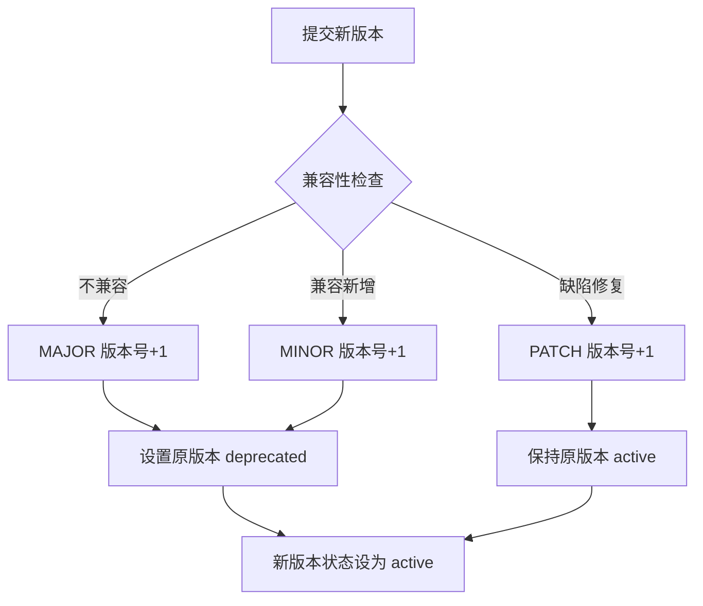
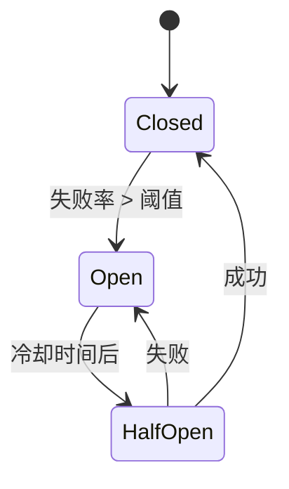
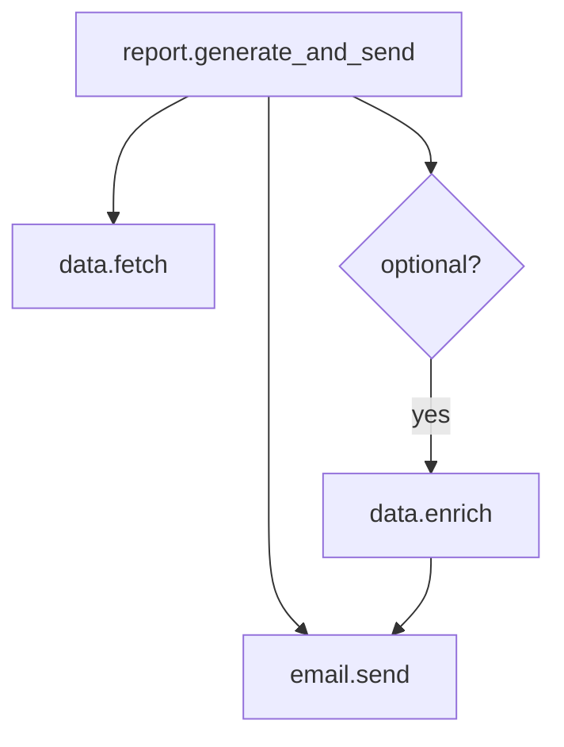
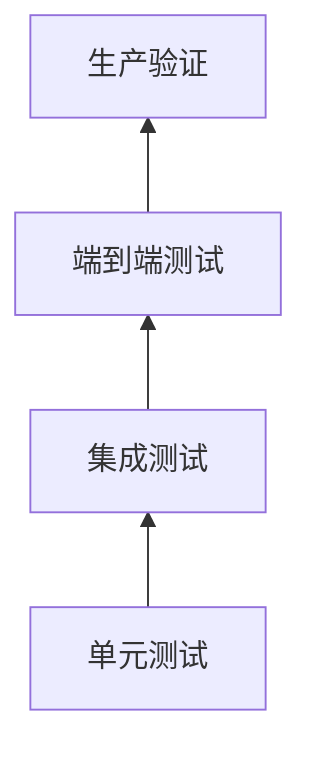

# 从对话到自动化流程：一个准确、稳定、可靠的智能体系统设计文档

---

## 项目概述

本项目旨在构建一个自适应智能体系统，能够根据用户需求智能选择工作模式，动态编排工具调用流程，并在执行过程中根据中间结果和用户介入动态调整计划。系统支持两种核心工作模式：

1. **Tool Use Mode**（单阶段工具调用模式）：遵循OpenAI Tool Calling规范，直接调用已注册工具，适用于简单任务
2. **Code-Plan Mode**（多阶段代码规划模式）：采用五步循环渐进式披露，支持复杂工作流编排，适用于多步骤、有条件分支、循环的复杂任务

系统通过统一的工具模型、动态上下文编排和用户协作机制，实现从简单查询到复杂自动化流程的全覆盖。

---

## 1. 核心设计理念

### 1.1 双模式自适应架构

系统提供两种互补的工作模式，根据任务复杂度自动选择或由用户指定：

**Tool Use Mode（已实现）**
- **适用场景**：简单查询、单工具调用、无需复杂逻辑编排的任务
- **工作方式**：单阶段工具调用，遵循OpenAI Tool Calling工业标准
- **优势**：响应速度快、架构简单、兼容性好

**Code-Plan Mode（新设计）**
- **适用场景**：多步骤任务、条件分支、循环、并行执行、复杂数据处理
- **工作方式**：五步循环渐进式披露（判断→规划→代码生成→执行→回答）
- **优势**：表达能力强、支持复杂逻辑、动态调整、用户协作

### 1.2 渐进式披露原则

工具信息分层加载，避免上下文过载：
- **L0**：名称 + 一句话功能描述
- **L1**：输入参数、输出格式、副作用类型
- **L2**：运行时特征（预估耗时、并发限制、所需权限）
- **L3**：详细文档、使用示例、边缘情况说明

### 1.3 历史分离机制

分离用户可见历史与过程历史，平衡用户体验与系统推理能力：
- **用户可见历史**：用户消息 + 智能体最终自然语言回答
- **过程历史**：五步循环内部记录（工具列表、方案、代码、执行输出等）
- **动态上下文编排**：每个步骤按需构建上下文视图

### 1.4 统一工具模型

支持多种工具形式，统一抽象为可调用接口：
- **Function Tool**：Python函数调用
- **MCP**：Model Context Protocol标准工具
- **CLI**：命令行程序调用
- **Skill**：预置技能/工作流
- **HTTP**：HTTP服务调用
- **Bash**：Bash命令执行

### 1.5 用户协作与动态调整

支持智能体主动澄清和用户主动介入，状态可恢复：
- **智能体主动提问**：需要补充信息、确认风险时暂停并询问
- **用户主动介入**：任何时刻可补充信息、修改目标、取消任务
- **状态恢复**：介入后从断点继续或重新规划，复用有效中间产物

---

## 0. 实施方案与技术选型（已确认）

### 0.1 交互模式
- **CLI 模式**：使用 Typer 构建命令行界面
- **工作模式**：支持 tool-use 和 code-plan 两种模式，可通过 `--mode` 选项和 `/mode` 命令切换

### 0.2 LLM 提供商
- **NVIDIA NIM API**：OpenAI 兼容格式
  - 环境变量：`NVIDIA_API_KEY`
  - 模型发现：启动时调用 `/v1/models` 端点动态获取可用模型
  - 自动发现：`auto_discover: true`
- **讯飞（xunfei）API**：支持 astron-code-latest 等模型
  - 环境变量：`XUNFEI_API_KEY`
  - 模型列表：配置文件中指定，`auto_discover: false`
- **扩展性**：支持配置多个LLM提供商，每个提供商可配置独立API密钥、基础URL和模型列表

### 0.3 模型选择策略
- **模型类型**：仅选择 `chat` 类型模型
- **评分函数**：综合计算模型得分，选取 Top 5
- **Fallback 机制**：按评分顺序自动降级

**评分函数规则**：

```
总分 = 基础分 + 参数大小分 + 系列分 + 后缀加分
```

| 评分项 | 分值 | 说明 |
|--------|------|------|
| 基础分 | 1000 | 仅 chat 模型获得，非 chat 模型 0 分 |
| 参数大小 | 0-100 | 70B+/72B+ → 100, 8x22B → 90, 32B → 80, 8x7B/13B → 70, 8B → 60, 7B → 50 |
| 模型系列 | 0-50 | deepseek/glm → 42, qwen → 40, minimax → 38, llama/mistral/gemma → 35, other → 20 |
| 后缀加分 | 20 | 名称包含 `instruct` 或 `chat` |

**模型系列优先级**：`deepseek` = `glm` > `qwen` > `minimax` > `llama` = `mistral` = `gemma` > `other`

### 0.4 向量嵌入
- **本地 GGUF 模型**：`hf_KimChen_bge-m3-q4_k_m.gguf`
- **向量数据库**：SQLite + sqlite-vec

### 0.5 实现范围
- **完整实现**：需求文档全部 17 个章节，不分阶段

---

## 1. 背景与目标

### 1.1 业务需求

设计并开发一个智能体系统，能够根据会话历史和当前用户提示词，自动生成可执行的自动化处理流程。该流程必须由程序准确、稳定、可靠地运行，满足生产环境要求。

### 1.2 核心挑战

- 任务复杂多变，可能包含多步骤、条件分支、循环、错误处理等逻辑。
- 需要整合大量预定义工具（可能成百上千个），每个工具都有明确的输入输出和安全约束。
- 必须保证运行时确定性和可审计性，避免大模型的随机性导致流程不可预测。

### 1.3 关键原则

工具是基础设施，由开发团队预先构建、测试和审计。运行时智能体只选择与编排已有工具，绝不动态创建或修改工具。

- 大模型用于意图理解、工具检索和流程规划，不用于实际执行底层逻辑。
- 大模型用于工具调用，统一使用 tool calling 这个事实的工业标准。
- 生成后的流程固化运行，不再依赖大模型。

---

## 2. 现有方案评估与不足

| 方案 | 优点 | 不足 |
|------|------|------|
| 单步 Tool Calling（如 OpenAI function calling） | 简单、标准 | 无法处理多步骤、条件循环等复杂逻辑 |
| ReAct 动态编排 | 灵活，适应未知任务 | 多次 LLM 调用，成本高，结果不确定 |
| Plan-and-Execute (DAG) | 执行图确定，可观测 | 表达能力受限（条件/循环需特殊节点），且仍可能依赖运行时 LLM |
| Coding Agent 生成代码 | 理论图灵完备，表达力强 | 代码不可靠、难复用、浪费 token，已被实践证实不适合生产 |
| Skill 自然语言流程 | 语义清晰 | 执行仍依赖大模型，不确定性未解决 |
| DSL/宏语言 | 可控 | 需设计新语法，LLM 生成和解析成本高 |

**结论**：需要一种结合 LLM 规划能力与确定性执行引擎的混合架构，且必须解决大规模工具集的管理问题。

---

## 3. 核心设计理念

### 3.1 确定性执行优先

自动化流程由 Python 代码结合工具调用实现，图灵完备。

运行时不再调用 LLM，仅由执行引擎驱动。

**设计原则：工具优先，但保留灵活性**
- 优先使用已注册工具完成系统资源访问（文件、网络、进程等）
- 生成的 Python 代码用于**工具流程编排和逻辑处理**
- 代码也可直接使用 Python 标准库进行数据处理和系统操作
- 所有操作完整记录审计日志，便于追溯和调试

### 3.2 工具注册中心 (Tool Registry) 管理大规模工具集

所有原子工具（weather, email, db query, http request 等）统一注册到本地 Tool Registry。

注册信息包含：名称、描述、输入输出 JSON Schema、调用端点、安全标签等。

### 3.3 单阶段 LLM 工具调用（简化架构）

**当前实现**：采用基于OpenAI Tool Calling规范的单阶段工具调用模型，遵循工业标准，简化了原有的两阶段设计，提高响应速度和系统可维护性。

**工作原理**：
1. **工具预加载与展开**：启动时预加载所有工具，对MCP工具自动连接服务器并展开所有子工具
2. **工具缓存**：将展开后的工具列表缓存，避免每次调用重复展开
3. **OpenAI Tool Calling循环**：
   - LLM接收用户输入、会话历史和完整的可用工具列表（OpenAI格式）
   - LLM可以选择直接回复或调用一个或多个工具
   - 如果调用工具，执行引擎执行工具并将结果作为tool消息添加到对话历史
   - 重复直到LLM不再调用工具，返回最终回复
4. **支持6种工具执行类型**：function、cli、http、skill、mcp、bash

**MCP工具展开机制**：
- MCP工具在上下文管理阶段自动连接到MCP服务器
- 服务器提供的每个工具作为独立工具加载到可用工具列表
- 大模型在使用tool calling时获得完整的工具信息
- 支持stdio、sse、streamable-http多种传输模式

**优势**：
- **标准兼容**：遵循OpenAI Tool Calling工业标准，兼容性更好
- **简化架构**：单阶段调用减少调度层级，降低系统复杂度
- **提高性能**：工具预加载和缓存减少延迟，单次LLM调用支持多工具选择
- **易于维护**：模块化工具执行器支持插件化扩展
- **MCP原生支持**：自动展开MCP工具，无需手动注册每个子工具

### 3.4 Code-Plan Mode详细设计

Code-Plan Mode采用五步循环渐进式披露架构，支持复杂工作流编排。本部分详细描述该模式的设计细节。

#### 3.4.1 五步循环详细设计

Code-Plan Mode遵循五步循环流程：判断→规划→代码生成→执行→回答。

**整体流程**：
```
用户输入
   ↓
[第一步] 判断是否需要工具
   ├─ 直接回答 → 输出给用户（结束）
   └─ 需要工具 → 输出工具列表
        ↓
[第二步] 根据工具列表加载L1，决定直接调用 or 生成自然语言方案
   ├─ 直接调用 → 生成结构化调用计划 → 执行（跳至第四步风格）
   └─ 自然语言方案 → 输出方案文本
        ↓
[第三步] 根据方案生成 Python 代码
   ↓
[第四步] 在沙盒中执行代码，捕获结果/错误
   ↓
[第五步] 根据执行结果生成自然语言回答
   ↓
返回用户
```

**第一步：判断是否需要工具**
- **输入**：用户最新消息 + 最近2-3轮用户可见历史 + 所有工具的 L0（名称+描述）
- **大模型任务**：判断自身知识能否回答。若能，直接输出最终回答；若不能，输出工具名称列表（去重）。
- **交互点**：若问题模糊无法确定工具，可主动询问用户澄清。
- **输出**：直接回答 或 工具列表（存入工作记忆）。

**第二步：直接调用或生成自然语言方案**
- **输入**：第一步输出的工具列表 + 这些工具的 L1 详情 + 用户可见历史（完整但可压缩） + 工作记忆中的相关中间结果
- **大模型任务**：
  - 评估任务复杂度：若只需顺序调用1-3个工具且无分支/循环/并行，则选择直接调用，生成结构化调用计划（JSON 序列，指定工具和参数）。
  - 否则，生成自然语言编排方案，描述步骤、依赖、条件、循环、异常处理。
- **交互点**：若缺少必要参数或参数有歧义，主动询问用户；若涉及高风险操作（如删除文件），请求用户确认。
- **输出**：调用计划 或 自然语言方案（存入工作记忆）。

**第三步：生成 Python 代码**
- **输入**：第二步生成的方案 + 涉及工具的 L1（参数类型、返回值格式） + 用户可见历史中的格式约束
- **大模型任务**：将方案转换为可执行的 Python 代码。代码必须：
  - 导入工具适配器（tool_gateway）
  - 实现方案中的顺序、并行（使用 concurrent.futures）、条件、循环
  - 包含错误处理（try-except）
  - 不包含危险操作（禁止 os.system, eval 等）
  - 输出结果以打印或返回方式提供（如 print(json.dumps(result))）
- **输出**：Python 代码文本（存入工作记忆）。

**第四步：执行 Python 代码**
- **输入**：第三步生成的代码 + 工具网关 + 沙盒配置
- **执行器**：
  - 将代码写入临时文件，在沙盒子进程中运行（限制 CPU、内存、超时、网络白名单）。
  - 捕获 stdout/stderr、返回值、退出码。
  - 若执行中需要用户输入（如 input()），通过交互管理器暂停并请求用户输入。
  - 若执行超时或触发安全策略，终止进程并记录错误。
- **输出**：执行结果（状态、数据、错误日志）存入工作记忆。

**第五步：生成自然语言回答**
- **输入**：第四步的执行结果 + 用户原始问题 + 最近几轮用户可见历史
- **大模型任务**：将结构化结果转换为友好、简洁的自然语言回答。若执行失败，解释原因并提供可操作建议。不编造信息。
- **输出**：最终回答，追加到用户可见历史。

#### 3.4.2 动态上下文编排机制

Code-Plan Mode采用动态上下文编排，为每个步骤按需构建上下文视图，区分用户可见历史与过程历史。

**上下文视图结构（每步骤前构建）**：
| 层级 | 内容 | 来源 | 管理策略 |
|------|------|------|----------|
| 核心层 | 当前步骤绝对必需的信息（如第一步的用户问题+L0） | 用户可见历史、工作记忆、工具注册表 | 不可淘汰，步骤结束后可降级 |
| 支撑层 | 有帮助但非必需的信息（如旧对话摘要、工具L2特征） | 用户可见历史（压缩）、过程历史 | 效用评分低于阈值则丢弃或压缩 |
| 压缩层 | 摘要或指针（如远距离会话摘要、工具L3文档ID） | 用户可见历史压缩、过程历史指针 | 需要时通过指针展开 |

**各步骤的上下文需求**：
| 步骤 | 核心层 | 支撑层 | 压缩层 |
|------|--------|--------|--------|
| 第一步 | 用户最新消息+最近2轮用户可见历史 + 所有工具L0 | 更早会话摘要 | 无 |
| 第二步 | 第一步工具列表 + 那些工具的L1 + 用户可见历史（全） | 工作记忆中相关中间结果 | 旧对话摘要 |
| 第三步 | 第二步方案 + 涉及工具的L1 | 代码生成模板（若有） | 工具L3指针 |
| 第四步 | 代码本身 + 工具网关接口 | 工作记忆变量绑定 | 无（执行器不需大模型） |
| 第五步 | 执行结果 + 用户原始问题 + 最近一轮用户可见历史 | 执行日志（可选） | 之前步骤中间产物指针 |

**上下文编排器工作流程**：
1. **需求解析**：根据步骤标识和分支，确定需要哪些信息类别及最大 token 预算。
2. **检索**：从用户可见历史（按相关性/时效性截取）、过程历史（按步骤依赖）、工具注册表（按层级）中提取原始信息。
3. **压缩**：对超过阈值的文本（如过长会话）调用轻量 LLM 生成摘要，保留关键实体和决策点；原始内容存入长期存储并返回指针。
4. **组装**：生成包含核心层、支撑层、压缩层的结构化上下文对象，注入特殊标记（如 `<core>`、`<support>`) 以辅助大模型区分重要性。
5. **缓存**：将上下文视图暂存，供下一步骤参考（但下一步会重新构建，可能部分复用）。

**用户主动介入时的上下文更新**：
- 用户新消息追加到用户可见历史。
- 清空当前步骤的上下文视图。
- 上下文编排器重新为第一步构建视图，但会保留工作记忆中尚未失效的中间产物（如已生成的代码，前提是用户未否定）。
- 工作记忆中的每个产物记录依赖条件（如“基于工具列表X和方案Y”）。当用户介入导致依赖条件变化（如用户说“不要用工具A”），相关产物自动标记为无效。
- 重新进入第一步，但可跳过部分步骤（例如用户只要求修改参数，可复用已有方案直接到第二步修改）。

#### 3.4.3 工作记忆与状态管理

工作记忆存储当前循环的中间产物，支持版本和依赖追踪。

**存储结构**：
工作记忆是一个键值存储，每个条目包含：
- `id`: 唯一标识
- `type`: 工具列表 | 自然语言方案 | 代码 | 执行结果 | 用户偏好
- `content`: 实际数据
- `step`: 产生步骤
- `dependencies`: 依赖的其它条目 id 列表（如代码依赖方案）
- `timestamp`: 创建时间
- `valid`: 是否仍有效（被用户介入标记无效时设为 False）

**状态恢复与回溯**：
- 每次检查点保存当前工作记忆的快照（轻量级，仅存储 id 和 valid 状态）。
- 用户介入后，重新执行第一步时，遍历工作记忆，将 valid=false 的条目及所有依赖它的条目递归标记为无效。
- 后续步骤只读取 valid=true 的条目，避免使用过时产物。

#### 3.4.4 执行沙盒设计

**安全执行环境**：
- **语言**：Python 3.10+。
- **隔离**：使用 subprocess 运行临时脚本，设置 timeout、ulimit 限制 CPU 和内存。
- **危险操作拦截**：
  - 代码生成时提示词禁止 import os、subprocess、socket、eval、exec 等，并后过滤。
  - 沙盒环境中，所有工具调用必须通过 tool_gateway，网关内校验参数、权限、频率。
  - CLI 工具白名单：仅允许执行预注册的命令路径，禁用 shell=True。
- **网络**：沙盒进程默认无网络，需要网络访问的工具（如 HTTP 请求）通过网关代理，可记录审计日志。
- **输出捕获**：捕获 stdout/stderr，限制最大输出大小（如 1MB），超出则截断并警告。

#### 3.4.5 与Skill工具的集成

SKILL.md被视为一种特殊工具，元数据如下：
- **L0**：技能名称 + 一句话描述（如“撰写周报技能”）
- **L1**：
  - 输入上下文：技能需要哪些信息（如“本周工作项列表”、“上周周报”）
  - 输出：技能生成的内容（如“周报文本”）
  - 内部是否调用其他工具：是/否（若否，则视为纯上下文注入）
- **L2**：预估 token 消耗、是否需用户交互
- **L3**：完整的 SKILL.md 内容（提示词模板、子步骤描述）

**调用模式**：
- **模式A（上下文注入）**：在第四步执行时，run_skill 函数读取 SKILL.md 作为系统提示词，将输入上下文作为用户消息，调用 LLM 并返回结果。这是默认模式。
- **模式B（子工作流展开）**：若 SKILL.md 包含结构化步骤，可在第三步生成代码时递归展开为对基础工具的调用序列。
- **渐进式披露**：第二步只加载 L1，第三步生成代码时若需详细内容才加载 L3。

#### 3.4.6 完整示例流程

**用户输入**：
> "帮我查一下北京和上海的天气，然后告诉我哪个更暖和，最后把结果发到我的邮箱。"

**执行流程**：
1. **第一步**：加载所有工具 L0，大模型判断需要工具，输出 ["get_weather", "compare_temperature", "send_email"]。
2. **第二步**：加载这三个工具的 L1（参数、输出）。大模型判断为复杂编排（多步、数据依赖），生成自然语言方案：
   ```
   步骤1：调用 get_weather 获取北京天气。
   步骤2：调用 get_weather 获取上海天气。
   步骤3：调用 compare_temperature 比较两者，得到更暖的城市。
   步骤4：调用 send_email 将比较结果发送给用户（收件人从会话历史提取，若无则询问）。
   ```
3. **第三步**：根据方案和工具 L1，生成 Python 代码（使用 tool_gateway.call），包含错误处理。
4. **第四步**：沙盒执行代码。假设获取天气成功，比较成功，发送邮件成功。
5. **第五步**：执行结果（成功，邮件已发送） → 大模型生成回答：“已为您比较北京和上海的天气，上海更暖和（25℃ vs 18℃），结果已发送至您的邮箱。”

**用户主动介入示例**：
若在第二步后用户发送“等一下，不要发邮件，直接显示结果”，则：
- 新消息追加到用户可见历史。
- 工作记忆中第二步的方案被标记无效。
- 重新从第一步开始（但可快速复用工具列表）。
- 第二步重新生成新方案（去掉 send_email），后续代码不含邮件发送。
- 最终回答直接显示比较结果。

---

## 4. 系统架构

### 4.1 Agent 体系架构

系统采用双层 Agent 架构，将 LLM 调用抽象为两类角色：

#### 4.1.1 核心定义

**元Agent（MetaAgent）**：原子 LLM 调用单元。一个系统提示词 + 一种上下文构建 + 一种处理逻辑（含终止条件）→ 从输入到输出。

**Agent**：从用户输入到最终回答的完整任务处理单元。可以是单个元Agent的简单包装，也可以是多个元Agent + 引擎的编排协作。对外统一暴露 `execute(input) → answer` 接口。

**关键区分**：

| | 元Agent（MetaAgent） | Agent |
|---|---|---|
| LLM 调用 | 单一模式（单轮 / 多轮 Tool Calling） | 不直接调用，委托给子元Agent |
| 系统提示词 | 一个 | 无（每个子元Agent各自持有） |
| 处理逻辑 | 固定（含终止条件） | 控制流（顺序、分支、跳过、重试） |
| 交互 | 无（只做输入→输出） | 可能有（用户介入、确认、澄清） |
| 状态 | 无状态 | 有状态（working memory 跨元Agent传递） |
| 终止条件 | LLM 行为决定 | 编排逻辑决定 |

#### 4.1.2 元Agent 类型

**单轮元Agent（SingleTurnMetaAgent）**：调一次 LLM，拿到结果即终止。

- 终止条件：永远在第一次 LLM 回复后终止
- 典型温度：0.1（追求确定性）
- 适用：判断、规划、代码生成、回答生成、Skill 调用

**多轮 Tool Calling 元Agent（ToolCallingMetaAgent）**：LLM ↔ 工具循环，直到 LLM 不返回 tool_calls。

- 终止条件：LLM 响应中不包含 tool_calls，或达到最大迭代次数
- 典型温度：0.7（需要灵活性）
- 适用：Tool Use 模式的完整工具调用循环

#### 4.1.3 Agent 类型

**简单 Agent**：包装单个元Agent，保持接口统一。

```python
class ToolUseAgent(Agent):
    """Tool Use 模式 = 单个 ToolCallingMetaAgent 的包装"""
    def __init__(self, meta: ToolCallingMetaAgent):
        self.meta = meta

    async def execute(self, user_input, history):
        result = await self.meta.run(MetaAgentInput(user_input, history, {...}))
        return AgentResult(final_answer=result.output, ...)
```

**编排型 Agent**：协调多个元Agent + 确定性引擎的协作，包含控制流、状态管理和用户交互逻辑。

```python
class CodePlanAgent(Agent):
    """Code-Plan 模式 = 4 个元Agent + 执行引擎的编排"""
    def __init__(self, llm, prompt_loader, execution_engine):
        self.judge   = JudgeMetaAgent(llm, prompt_loader, "code_plan_judge.j2")
        self.planner = PlanMetaAgent(llm, prompt_loader, "code_plan_plan.j2")
        self.codegen = CodeGenMetaAgent(llm, prompt_loader, "code_plan_code_generation.j2")
        self.answer  = AnswerMetaAgent(llm, prompt_loader, "code_plan_answer.j2")
        self.engine  = execution_engine  # 确定性执行引擎，不是元Agent

    async def execute(self, user_input, history):
        # Step 1: 判断 — 控制流分支
        r = await self.judge.run(MetaAgentInput(...))
        if r.output_type == "text":  # 直接回答，无需工具
            return self._to_result(r)

        # Step 2: 规划
        r = await self.planner.run(MetaAgentInput(...))

        # Step 3-4: 有条件跳过（结构化调用计划不需要代码生成）
        if r.output_type == "plan":
            code = await self.codegen.run(MetaAgentInput(...))
            exec_result = await self.engine.execute_code(code.output)
        else:
            exec_result = await self.engine.execute_plan(r.output)

        # Step 5: 回答
        r = await self.answer.run(MetaAgentInput(...))
        return self._to_result(r)
```

#### 4.1.4 体系结构图

```
元Agent（MetaAgent）                  Agent
├── ToolCallingMetaAgent              ├── ToolUseAgent          # 简单 Agent：包装单个元Agent
│   └── prompt: tool_use.j2           │
├── JudgeMetaAgent                    └── CodePlanAgent         # 编排型 Agent：多元Agent + 引擎协作
│   └── prompt: code_plan_judge.j2        ├── JudgeMetaAgent
├── PlanMetaAgent                         ├── PlanMetaAgent
│   └── prompt: code_plan_plan.j2         ├── CodeGenMetaAgent
├── CodeGenMetaAgent                      ├── ExecutionEngine（确定性执行，非元Agent）
│   └── prompt: code_plan_code_gen.j2     └── AnswerMetaAgent
├── AnswerMetaAgent
│   └── prompt: code_plan_answer.j2
└── SkillMetaAgent
    └── prompt: SKILL.md 内容
```

**外部调用入口**统一为 Agent：

```
QDAgent（入口）
├── mode=tool-use  → ToolUseAgent.execute()
└── mode=code-plan → CodePlanAgent.execute()
```

#### 4.1.5 数据模型

**元Agent 输入输出**：

```python
@dataclass
class MetaAgentInput:
    user_message: str               # 用户消息
    history: list[dict]             # 会话历史
    context: dict                   # 元Agent专用上下文（tools_l0/l1、working memory 等）

@dataclass
class MetaAgentOutput:
    output: Any                     # 输出内容（文本、JSON、代码等）
    output_type: str                # "text" | "tool_list" | "plan" | "code" | "answer"
    success: bool
    messages: list[dict]            # 完整消息轨迹（可观测性）
    metadata: MetaAgentMetadata

@dataclass
class MetaAgentMetadata:
    model: str
    total_tokens: int
    latency_ms: int
    iterations: int                 # 1=单轮, N=多轮 tool calling
```

**Agent 输出**：

```python
@dataclass
class AgentResult:
    final_answer: str               # 最终回答
    success: bool
    meta_traces: list[MetaAgentOutput]   # 内部元Agent执行轨迹
    working_memory: dict                  # 跨元Agent的中间状态（仅编排型Agent有）
    interaction_log: list[dict]           # 用户交互记录
    metadata: dict
```

#### 4.1.6 与现有代码的映射

| 元Agent / Agent | 现有代码 |
|---|---|
| ToolCallingMetaAgent | `QDAgent._openai_tool_calling_loop()` |
| JudgeMetaAgent | `CodePlanModeOrchestrator._step_judge()` |
| PlanMetaAgent | `CodePlanModeOrchestrator._step_plan()` |
| CodeGenMetaAgent | `CodePlanModeOrchestrator._step_code_generation()` |
| AnswerMetaAgent | `CodePlanModeOrchestrator._step_answer()` |
| SkillMetaAgent | `ExecutionEngine` 中的 skill 执行分支 |
| ToolUseAgent | `ToolUseModeOrchestrator` + `_openai_tool_calling_loop()` |
| CodePlanAgent | `CodePlanModeOrchestrator`（五步循环逻辑） |

#### 4.1.7 设计收益

1. **独立可测**：每个元Agent可独立测试，mock LLM 即可验证，不再需要跑完整流程
2. **Skill 天然是元Agent**：不再需要特殊的 skill 执行分支，统一为 SkillMetaAgent
3. **编排可变**：Code-Plan 的步骤可以跳过、重试、替换，因为每步是独立元Agent
4. **新增模式容易**：新 Agent = 新的元Agent组合，不需要编写新的 Orchestrator 类
5. **接口统一**：外部只调用 Agent.execute()，不关心内部是简单包装还是编排协作

### 4.2 总体模块

系统支持两种工作模式，共享部分核心组件：

**Tool Use Mode（单阶段工具调用模式）**：
```
[用户输入] → [上下文管理器] → [单阶段调度器 (ToolUseModeOrchestrator)]
                                   ├─ 工具预加载与缓存
                                   │   ├─ 加载所有注册工具
                                   │   ├─ MCP工具自动展开
                                   │   └─ 构建OpenAI格式工具列表
                                   └─ OpenAI Tool Calling循环
                                       ├─ LLM决策（直接回复或工具调用）
                                       ├─ 工具执行
                                       └─ 结果反馈循环

[工具执行引擎] → [回复生成]
    ├─ function (Python函数)
    ├─ cli (命令行程序)
    ├─ http (HTTP服务)
    ├─ skill (复杂工作流)
    ├─ mcp (Model Context Protocol)
    └─ bash (Bash命令)
```

**Code-Plan Mode（多阶段代码规划模式）**：
```
[用户输入] → [上下文管理器] → [Code-Plan调度器 (CodePlanModeOrchestrator)]
                                   ├─ 渐进式工具披露管理器
                                   │   ├─ L0工具列表
                                   │   ├─ L1工具详情
                                   │   └─ 动态上下文编排
                                   └─ 五步循环引擎
                                       ├─ 第一步：判断是否需要工具
                                       ├─ 第二步：规划（直接调用或生成方案）
                                       ├─ 第三步：代码生成
                                       ├─ 第四步：沙盒执行
                                       └─ 第五步：生成回答

[工作记忆] ←→ [五步循环引擎]（存储中间产物）
[执行沙盒] ←→ [第四步]（安全执行代码）
[工具执行引擎] ←→ [第四步]（通过tool_gateway调用工具）

[工具执行引擎] → [回复生成]（同Tool Use Mode）
```

**共享组件**：
- **上下文管理器**：管理会话历史和系统提示词
- **工具执行引擎**：统一执行各种类型工具
- **工具注册中心**：存储和管理所有注册工具
- **配置管理系统**：统一配置管理

### 4.3 模块说明

#### 4.3.1 上下文管理器

- 维护会话历史，裁剪过长的历史。
- 注入系统提示词（角色、安全边界等）。

#### 4.3.2 单阶段调度器 (ToolUseModeOrchestrator)

**实现架构**：基于OpenAI Tool Calling规范的单阶段调度器，遵循工业标准，支持工具预加载、MCP工具自动展开和缓存机制。

**核心组件**：
- **工具预加载器**：启动时加载所有注册工具，对MCP工具自动连接服务器
- **MCP工具展开器**：将MCP服务器提供的每个工具作为独立工具加载
- **工具缓存**：缓存展开后的工具列表和OpenAI格式工具定义
- **OpenAI Tool Calling循环**：实现标准的多轮工具调用流程

**工作原理**：
1. **初始化阶段**：
   - 预加载所有注册工具，连接MCP服务器
   - 展开MCP工具，获取服务器提供的所有子工具
   - 构建OpenAI格式工具列表并缓存

2. **请求处理阶段**：
   - 接收用户输入和会话历史
   - 将缓存的工具列表提供给LLM（遵循OpenAI Tool Calling格式）
   - LLM根据意图选择：直接回复或调用一个或多个工具

3. **工具执行循环**：
   - 如果LLM调用工具，执行引擎执行对应工具
   - 工具结果作为`tool`消息添加到对话历史
   - 将更新后的对话历史再次发送给LLM
   - 重复直到LLM返回最终回复（不再调用工具）

4. **工具执行路由**：根据工具类型调用相应的执行器

**工具执行类型**：
系统支持 6 种工具执行类型，每种类型有专用的模块化执行器：

| 类型 | 说明 | 适用场景 |
|------|------|----------|
| `function` | Python 函数调用 | 本地 Python 代码（如echo工具） |
| `cli` | 命令行程序调用 | 外部可执行程序 |
| `skill` | 预置技能/工作流 | 多步骤组合流程 |
| `http` | HTTP 服务调用 | 远程 API 服务（如搜索工具） |
| `mcp` | Model Context Protocol | MCP 标准工具（自动展开子工具） |
| `bash` | Bash 命令执行 | 系统 shell 命令 |

**MCP工具特殊处理**：
- **自动连接**：启动时自动连接MCP服务器
- **工具展开**：将服务器工具映射为独立工具对象
- **执行器复用**：同一MCP服务器的工具共享执行器连接
- **连接管理**：会话结束时自动关闭所有MCP连接

**架构优势**：
- **标准兼容**：遵循OpenAI Tool Calling工业标准，兼容性更好
- **性能优化**：工具预加载和缓存减少延迟，避免重复展开
- **MCP原生支持**：自动展开MCP工具，无需手动注册每个子工具
- **扩展性强**：模块化执行器支持新工具类型，易于功能扩展
- **资源管理**：统一的连接生命周期管理，避免资源泄漏

#### 4.3.3 Tool Registry

嵌入式数据库 SQLite，支持工具注册、检索、更新和管理。

**数据存储**：
- **数据库**：SQLite（`data/tools.db`）
- **表结构**：存储工具ID、名称、描述、参数schema、执行配置、安全标签、元数据等
- **版本管理**：支持工具版本状态（draft/active/deprecated/retired）

**检索功能**：
- **按ID检索**：精确匹配工具ID
- **按名称检索**：查找工具名称
- **列表查询**：获取所有工具列表
- **分类过滤**：按工具类别筛选

**向量检索支持**（配置预留）：
- **Embedding模型配置**：`hf_KimChen_bge-m3-q4_k_m.gguf`（GGUF量化格式）
- **向量扩展**：sqlite-vec配置支持（需额外安装）
- **相似度算法**：余弦相似度（配置预留）

**注意**：当前版本主要使用精确匹配检索，向量检索功能为配置预留，需要额外安装sqlite-vec扩展。


**内置工具**

系统预置以下工具，通过`tools init`命令注册到数据库：

| 工具 ID | 名称 | 类型 | 说明 |
|---------|------|------|------|
| `echo` | echo | function | 回显输入内容，用于测试 |
| `search.serper` | serper_search | http | 使用Serper API进行网络搜索 |
| `search.tavily` | tavily_search | http | 使用Tavily API进行AI增强搜索 |
| `search.baidu` | baidu_search | http | 使用百度搜索API进行中文搜索 |
| `search.web` | web_search | skill | 通用网络搜索工具，自动选择合适的搜索引擎 |
| `execute_bash` | execute_bash | bash | 执行Bash命令 |

**工具注册方式**：
- **命令行注册**：`uv run qd-agents tools init` 初始化所有内置工具
- **数据库存储**：工具定义存储在SQLite数据库中
- **动态加载**：启动时从数据库加载所有注册工具

**工具执行类型**

支持以下主流工具执行方式：

| 类型 | 说明 | 适用场景 |
|------|------|----------|
| `function` | Python 函数调用 | 本地 Python 代码 |
| `cli` | 命令行程序调用 | 外部可执行程序 |
| `skill` | 预置技能/工作流 | 多步骤组合流程 |
| `http` | HTTP 服务调用 | 远程 API 服务 |
| `mcp` | Model Context Protocol | MCP 标准工具 |

**工具注册数据模型 - HTTP 示例**

```json
{
  "id": "weather.get",
  "name": "get_weather",
  "description": "获取指定城市的当前天气",
  "parameters": {
    "type": "object",
    "properties": {
      "city": {"type": "string"}
    },
    "required": ["city"]
  },
  "execution": {
    "type": "http",
    "endpoint": "http://weather-service/current",
    "method": "GET"
  },
  "security": ["readonly", "no_side_effects"],
  "metadata": {
    "category": "utilities",
    "tags": ["weather", "forecast"],
    "version": "1.0.0"
  }
}
```

**工具注册数据模型 - Python Function 示例**

```json
{
  "id": "math.calculate",
  "name": "calculate",
  "description": "执行数学计算",
  "parameters": {
    "type": "object",
    "properties": {
      "expression": {"type": "string"}
    },
    "required": ["expression"]
  },
  "execution": {
    "type": "function",
    "module": "my_tools.math",
    "function": "evaluate"
  },
  "security": ["readonly", "no_side_effects"],
  "metadata": {
    "category": "utilities",
    "tags": ["math", "calculation"],
    "version": "1.0.0"
  }
}
```

**工具注册数据模型 - CLI 示例**

```json
{
  "id": "file.list",
  "name": "list_files",
  "description": "列出目录下的文件",
  "parameters": {
    "type": "object",
    "properties": {
      "path": {"type": "string"}
    },
    "required": ["path"]
  },
  "execution": {
    "type": "cli",
    "command": "ls",
    "args": ["-la", "{path}"],
    "timeout": 30
  },
  "security": ["readonly"],
  "metadata": {
    "category": "filesystem",
    "tags": ["file", "directory"],
    "version": "1.0.0"
  }
}
```

**工具注册数据模型 - Skill 示例**

```json
{
  "id": "report.generate_and_send",
  "name": "generate_and_send_report",
  "description": "生成报告并发送邮件",
  "parameters": {
    "type": "object",
    "properties": {
      "report_type": {"type": "string"},
      "recipient": {"type": "string"}
    },
    "required": ["report_type", "recipient"]
  },
  "execution": {
    "type": "skill",
    "skill_id": "builtin.report_workflow"
  },
  "security": ["readwrite"],
  "metadata": {
    "category": "workflows",
    "tags": ["report", "email"],
    "version": "1.0.0"
  }
}
```

**工具注册数据模型 - MCP 示例**

```json
{
  "id": "browser.navigate",
  "name": "navigate",
  "description": "在浏览器中打开指定 URL",
  "parameters": {
    "type": "object",
    "properties": {
      "url": {"type": "string"}
    },
    "required": ["url"]
  },
  "execution": {
    "type": "mcp",
    "server": "mcp.config.usrlocalmcp.browser-tools",
    "tool": "puppeteer_navigate"
  },
  "security": ["readwrite"],
  "metadata": {
    "category": "browser",
    "tags": ["web", "navigation"],
    "version": "1.0.0"
  }
}
```

**工具注册数据模型 - Bash 示例**

```json
{
  "id": "execute_bash",
  "name": "execute_bash",
  "description": "执行 Bash 命令",
  "parameters": {
    "type": "object",
    "properties": {
      "command": {
        "type": "string",
        "description": "要执行的 Bash 命令"
      },
      "timeout": {
        "type": "integer",
        "description": "执行超时时间（秒），默认 30",
        "default": 30
      }
    },
    "required": ["command"]
  },
  "execution": {
    "type": "bash",
    "shell_command": "{command}",
    "shell": "bash",
    "timeout": 30
  },
  "security": ["readwrite", "system_access"],
  "metadata": {
    "category": "system",
    "tags": ["bash", "shell", "command"],
    "version": "1.0.0"
  }
}
```

**预置搜索工具**

以下搜索工具需预先注册到 Tool Registry：

**Serper Search 工具**

```json
{
  "id": "search.serper",
  "name": "serper_search",
  "description": "使用 Serper API 进行网络搜索，获取网页摘要和链接",
  "parameters": {
    "type": "object",
    "properties": {
      "query": {
        "type": "string",
        "description": "搜索关键词或问题"
      },
      "num": {
        "type": "integer",
        "description": "返回结果数量，默认 10",
        "default": 10
      }
    },
    "required": ["query"]
  },
  "execution": {
    "type": "http",
    "endpoint": "https://google.serper.dev/search",
    "method": "POST",
    "headers": {
      "X-API-KEY": "${SERPER_API_KEY}",
      "Content-Type": "application/json"
    }
  },
  "security": ["readonly", "external_api"],
  "metadata": {
    "category": "search",
    "tags": ["web", "search", "serper"],
    "version": "1.0.0"
  }
}
```

**Tavily Search 工具**

```json
{
  "id": "search.tavily",
  "name": "tavily_search",
  "description": "使用 Tavily API 进行 AI 增强的网络搜索，支持深度搜索和答案提取",
  "parameters": {
    "type": "object",
    "properties": {
      "query": {
        "type": "string",
        "description": "搜索关键词或问题"
      },
      "search_depth": {
        "type": "string",
        "enum": ["basic", "advanced"],
        "description": "搜索深度，默认 basic",
        "default": "basic"
      },
      "include_answer": {
        "type": "boolean",
        "description": "是否包含 AI 生成的答案",
        "default": true
      },
      "max_results": {
        "type": "integer",
        "description": "返回结果数量，默认 5",
        "default": 5
      }
    },
    "required": ["query"]
  },
  "execution": {
    "type": "http",
    "endpoint": "https://api.tavily.com/search",
    "method": "POST",
    "headers": {
      "Authorization": "Bearer ${TAVILY_API_KEY}",
      "Content-Type": "application/json"
    }
  },
  "security": ["readonly", "external_api"],
  "metadata": {
    "category": "search",
    "tags": ["web", "search", "tavily", "ai"],
    "version": "1.0.0"
  }
}
```

**Baidu Search 工具**

```json
{
  "id": "search.baidu",
  "name": "baidu_search",
  "description": "使用百度搜索 API 进行中文网络搜索",
  "parameters": {
    "type": "object",
    "properties": {
      "query": {
        "type": "string",
        "description": "搜索关键词或问题"
      },
      "pn": {
        "type": "integer",
        "description": "起始结果页码，默认 0",
        "default": 0
      },
      "rn": {
        "type": "integer",
        "description": "每页结果数量，默认 10",
        "default": 10
      }
    },
    "required": ["query"]
  },
  "execution": {
    "type": "http",
    "endpoint": "https://sp0.baidu.com/5a1Fazu8AA54nxGko9WTAnF6hhy/su",
    "method": "GET"
  },
  "security": ["readonly", "external_api"],
  "metadata": {
    "category": "search",
    "tags": ["web", "search", "baidu", "chinese"],
    "version": "1.0.0"
  }
}
```

**Web Search 工具（统一接口）**

```json
{
  "id": "search.web",
  "name": "web_search",
  "description": "通用网络搜索工具，自动选择合适的搜索引擎进行搜索",
  "parameters": {
    "type": "object",
    "properties": {
      "query": {
        "type": "string",
        "description": "搜索关键词或问题"
      },
      "num_results": {
        "type": "integer",
        "description": "返回结果数量，默认 5",
        "default": 5
      },
      "engine": {
        "type": "string",
        "enum": ["auto", "serper", "tavily", "baidu"],
        "description": "指定搜索引擎，auto 表示自动选择",
        "default": "auto"
      },
      "language": {
        "type": "string",
        "description": "搜索结果语言偏好，例如 zh-CN、en-US",
        "default": "zh-CN"
      }
    },
    "required": ["query"]
  },
  "execution": {
    "type": "skill",
    "skill_id": "builtin.web_search_router"
  },
  "security": ["readonly", "external_api"],
  "metadata": {
    "category": "search",
    "tags": ["web", "search", "unified"],
    "version": "1.0.0"
  }
}
```

---

## 5. 工作流示例

### 场景一：简单逻辑（直接 Tool Calling）

**用户输入**：
> "查询今天北京的天气"

**工作流程**：

1. **工具预加载**：系统启动时已预加载所有注册工具，包括天气工具（如假设的`get_weather`）
2. **OpenAI Tool Calling**：
   - LLM接收用户输入和完整的工具列表（OpenAI格式）
   - LLM识别需要调用天气工具，直接返回tool call
3. **工具执行**：执行引擎调用`get_weather`工具，传入参数`{"city": "北京"}`
4. **结果返回**：工具结果作为`tool`消息返回，LLM生成最终回复

**LLM 响应示例**：

```json
{
  "id": "chatcmpl-123",
  "choices": [{
    "index": 0,
    "message": {
      "role": "assistant",
      "content": null,
      "tool_calls": [{
        "id": "call_456",
        "type": "function",
        "function": {
          "name": "get_weather",
          "arguments": "{\"city\": \"北京\"}"
        }
      }]
    }
  }]
}
```

**工具执行后，LLM接收工具结果并生成最终回复**。

---

### 场景二：复杂逻辑（多工具调用与条件判断）

**用户输入**：
> "查询今天北京的天气，如果温度超过30度，给我发一封邮件提醒。"

**工作流程**：

1. **首次LLM调用**：LLM接收用户输入和工具列表，识别需要先查询天气
2. **第一次工具调用**：调用`get_weather`工具获取北京天气
3. **工具结果反馈**：天气结果作为`tool`消息返回给LLM
4. **第二次LLM调用**：LLM分析天气结果，判断温度超过30度，决定调用邮件工具
5. **第二次工具调用**：调用`send_email`工具发送提醒邮件
6. **最终回复**：LLM生成最终回复，总结已执行的操作

**多轮对话消息流示例**：

```json
// 第一轮：用户输入
{
  "role": "user",
  "content": "查询今天北京的天气，如果温度超过30度，给我发一封邮件提醒。"
}

// 第二轮：LLM调用天气工具
{
  "role": "assistant",
  "content": null,
  "tool_calls": [{
    "id": "call_123",
    "type": "function",
    "function": {
      "name": "get_weather",
      "arguments": "{\"city\": \"北京\"}"
    }
  }]
}

// 第三轮：天气工具结果
{
  "role": "tool",
  "tool_call_id": "call_123",
  "content": "{\"temperature\": 32, \"condition\": \"晴\", \"city\": \"北京\"}"
}

// 第四轮：LLM分析结果并调用邮件工具
{
  "role": "assistant",
  "content": null,
  "tool_calls": [{
    "id": "call_456",
    "type": "function",
      "type": "function",
      "function": {
        "name": "coding_tool_use",
        "arguments": {
          "code": "weather = get_weather(city=\"北京\")\nif weather.temperature > 30:\n    send_email(to=\"user@example.com\", subject=\"高温提醒\", body=f\"北京今天温度{weather.temperature}度，超过30度了！\")\nreturn weather"
        }
      }
    }
  ]
}
```

代码执行前先进行语法校验，然后记录执行轨迹。

**代码调用工具机制**：
生成的 Python 代码执行时，所有已注册工具以同名函数形式注入到执行环境中，可直接调用。例如：
- `get_weather(city="北京")` → 调用 `weather.get` 工具
- `send_email(to="...")` → 调用 `email.send` 工具

---

## 6. 单阶段工具调用的设计决策

### 6.1 为何选择基于OpenAI Tool Calling的单阶段架构？

- **标准兼容**：遵循OpenAI Tool Calling工业标准，确保与各类LLM提供商兼容
- **性能优化**：工具预加载和缓存减少延迟，支持多工具单次调用决策
- **架构简化**：消除两阶段调度的复杂性和状态管理，统一为标准的tool calling循环
- **工具集规模可控**：当前工具集规模适中，单次prompt可容纳所有工具定义
- **MCP原生集成**：自动展开MCP工具，无需手动处理MCP服务器连接和工具发现
- **维护性提升**：基于标准接口，降低系统复杂度和测试负担

**单阶段架构优势**：
- **工业标准**：遵循OpenAI Tool Calling规范，兼容性更好
- **响应速度快**：工具预加载减少延迟，支持高效的多轮工具调用
- **系统简洁**：统一的标准接口，减少代码复杂性和潜在错误点
- **MCP友好**：自动处理MCP工具展开，简化MCP服务器集成
- **调试方便**：标准的消息流更易于追踪和调试
- **扩展性强**：支持动态添加新工具类型，无需修改核心架构

### 6.2 技术实现要点

**工具预加载与缓存策略**：
- **启动时预加载**：系统启动时加载所有注册工具，连接MCP服务器
- **MCP工具展开**：自动展开MCP服务器提供的所有子工具
- **工具缓存**：缓存展开后的工具列表和OpenAI格式定义，避免重复计算
- **连接池管理**：MCP连接复用，同一服务器工具共享执行器

**OpenAI Tool Calling循环**：
- **标准消息流**：遵循OpenAI标准的user/assistant/tool消息格式
- **多轮工具调用**：支持LLM多次调用工具，每次调用后反馈结果
- **迭代限制**：最大迭代次数限制，防止无限循环
- **错误处理**：工具调用失败时提供友好错误信息

**性能保障措施**：
- **异步并发**：异步执行工具调用，优化系统响应
- **连接超时**：MCP连接超时控制，防止阻塞
- **执行超时**：每个工具独立超时设置，防止单个工具阻塞系统
- **熔断机制**：工具调用失败率过高时自动熔断

**MCP集成优化**：
- **传输模式支持**：stdio、sse、streamable-http多种传输模式
- **自动重连**：MCP连接异常时自动重试
- **资源清理**：会话结束时自动关闭所有MCP连接
- **子工具映射**：MCP工具名到独立工具对象的智能映射

**扩展性设计**：
- **模块化执行器**：6种工具类型各有专用执行器，支持新类型扩展
- **插件化架构**：工具注册、执行器注册支持插件化扩展
- **配置驱动**：丰富的配置选项支持不同场景调优
- **技能转MCP**：自动将技能目录转换为MCP服务器，扩展工具能力

---

## 7. 工具注册中心 (Tool Registry) 实现要点

### 7.1 存储模型

**核心关系表**：`tools`表存储所有工具定义
- `id`：工具唯一标识（主键）
- `name`：工具名称（在tool calling中使用）
- `description`：工具描述
- `schema_json`：参数JSON Schema定义
- `execution_config`：执行配置（类型、端点、命令等）
- `security_tags`：安全标签数组
- `metadata_json`：元数据（类别、标签、版本等）
- `created_at` / `updated_at`：创建和更新时间

**数据模型**：基于Pydantic的Tool模型，包含：
- `Tool`：工具定义，包含ID、名称、描述、参数、执行配置等
- `ToolExecutionConfig`：执行配置，支持6种工具类型
- `ToolMetadata`：元数据，包含版本管理和分类信息
- `ToolVersionStatus`：版本状态枚举（draft/active/deprecated/retired）

**向量索引支持**：配置预留向量检索功能
- **字段预留**：`name + description`字段可用于embedding
- **扩展支持**：sqlite-vec配置支持，需要额外安装
- **检索接口**：相似度检索接口预留

### 7.2 集成方式

**嵌入式数据库**：SQLite（`data/tools.db`）
- 零配置，无需外部数据库服务
- 支持事务和并发访问
- 数据库文件位于项目data目录

**Python SDK接口**：
- `register()`：注册新工具
- `get()` / `get_by_name()`：按ID或名称获取工具
- `list_all()`：列出所有工具
- `search()`：搜索工具（关键词匹配）
- `update()` / `delete()`：更新和删除工具

**工具管理命令**：
- `tools init`：初始化内置工具到数据库
- `tools list`：列出所有已注册工具
- `tools mcp add`：注册MCP服务器

**版本管理**：
- 语义化版本支持（MAJOR.MINOR.PATCH）
- 版本状态生命周期管理
- 默认版本策略配置（latest_active等）

---

## 8. 提示词管理设计

### 8.1 技术选型

使用 **Jinja2** 作为提示词模板引擎。

**选型理由**：
- Jinja2 是 Python 生态最成熟的模板引擎，每月下载量超 1 亿次
- 语法简洁强大，支持条件判断、循环、继承等高级特性
- 轻量级，无额外依赖负担
- 所有 Python 开发者都熟悉，学习成本低

### 8.2 模板组织方式

模板文件统一存放于 `src/qd_agents/prompts/templates/` 目录，使用 `.j2` 扩展名。

**实际模板结构**：
```
src/qd_agents/prompts/
├── __init__.py
├── loader.py          # 提示词加载器
└── templates/
    └── tool_use.j2    # 主要系统提示词模板
```

**模板配置**：
- **模板目录**：通过`prompts.template_dir`配置项指定
- **默认语言**：`zh-CN`（中文）
- **缓存启用**：模板渲染结果缓存，TTL 3600秒
- **环境变量支持**：模板中支持环境变量插值

### 8.3 核心功能

**PromptLoader 类**（简化实现）：
- `get_template(template_name)` - 获取Jinja2模板对象
- `render(template_name, **kwargs)` - 渲染指定模板文件，支持缓存
- `render_string(template_string, **kwargs)` - 渲染模板字符串
- `list_templates()` - 列出templates目录下所有可用模板

**模板缓存机制**：
- **缓存启用**：`prompts.cache_enabled`配置控制
- **缓存TTL**：`prompts.cache_ttl`配置（默认3600秒）
- **缓存键**：基于模板名称和渲染参数生成

**配置集成**：
- 通过`config.prompts`配置节管理模板设置
- 支持环境变量插值：`${VAR_NAME}`或`${VAR_NAME:-default}`
- 模板目录路径支持相对路径和绝对路径

### 8.4 模板设计规范

**当前主要模板**：`tool_use.j2` - 工具调用模式系统提示词

**模板变量**：
- `tools` - 可用工具列表（Tool对象数组）
- `tool_parameters` - 工具参数（通过`tool.parameters | tojson`过滤器转换为JSON）

**实际模板内容**：
```jinja2
你是一个智能助手，能够调用工具来帮助用户完成任务。

注意：我们是在Windows环境下工作。

## 可用工具


你可以使用以下工具：

### {{ tool.name }}
- 描述: {{ tool.description }}
- 参数: {{ tool.parameters | tojson }}



## 使用说明

1. 使用标准的 OpenAI Tool Calling 格式调用工具。
2. 根据工具描述选择最合适的工具。
3. 严格按照工具的参数定义提供参数。
4. 如果用户的问题需要实时信息或外部知识，优先使用 search.web 工具进行网络搜索（如果可用）。
5. 如果没有任何工具适合，直接回复用户，说明你无法完成该任务。

现在，请根据用户请求选择合适的工具调用。
```

**模板特点**：
- **工具为中心**：重点展示可用工具及其描述、参数
- **标准格式**：强调使用OpenAI Tool Calling标准格式
- **环境感知**：明确Windows环境上下文
- **搜索优先**：推荐优先使用search.web工具获取实时信息
- **安全边界**：无合适工具时直接回复，避免强制调用

---

## 9. 确定性执行设计补充

### 9.1 可靠性保障

- **工具执行超时**：每个工具独立超时配置（默认30秒），通过`execution.per_tool_timeout`可自定义
- **异常捕获**：工具执行异常时捕获并返回友好错误信息，不导致系统崩溃
- **重试机制**：支持4种退避策略（fixed/linear/exponential/exponential_with_jitter）
- **熔断器模式**：工具调用失败率过高时自动熔断，防止雪崩效应
- **连接管理**：MCP连接超时控制，自动重连和资源清理

### 9.2 可观测性

**执行轨迹 Schema**（基于实际实现）

```json
{
  "trace_id": "uuid",
  "session_id": "uuid",
  "timestamp": "2026-04-21T09:00:00Z",
  "user_input": "查询今天北京的天气，如果温度超过30度发邮件提醒",
  "orchestration_result": {
    "final_output": "已查询北京天气（32°C）并发送高温提醒邮件",
    "final_status": "completed",
    "total_latency_ms": 3200,
    "messages": [
      {"role": "user", "content": "查询今天北京的天气..."},
      {"role": "assistant", "content": null, "tool_calls": [...]},
      {"role": "tool", "tool_call_id": "call_123", "content": "{\"temperature\": 32, \"condition\": \"晴\"}"},
      {"role": "assistant", "content": null, "tool_calls": [...]},
      {"role": "tool", "tool_call_id": "call_456", "content": "{\"status\": \"sent\"}"},
      {"role": "assistant", "content": "已查询北京天气（32°C）并发送高温提醒邮件"}
    ]
  },
  "agent_result": {
    "final_output": "已查询北京天气（32°C）并发送高温提醒邮件",
    "total_duration_ms": 3200
  },
  "tool_executions": [
    {
      "step": 1,
      "tool_call_id": "call_123",
      "tool_name": "get_weather",
      "tool_id": "weather.get",
      "input": {"city": "北京"},
      "output": {"temperature": 32, "condition": "晴", "city": "北京"},
      "start_time": "2026-04-21T09:00:01Z",
      "end_time": "2026-04-21T09:00:02Z",
      "duration_ms": 850,
      "status": "success",
      "error": null
    },
    {
      "step": 2,
      "tool_call_id": "call_456",
      "tool_name": "send_email",
      "tool_id": "email.send",
      "input": {"to": "user@example.com", "subject": "高温提醒", "body": "北京今天温度32度，超过30度了！"},
      "output": {"status": "sent", "message_id": "msg_789"},
      "start_time": "2026-04-21T09:00:02Z",
      "end_time": "2026-04-21T09:00:03Z",
      "duration_ms": 600,
      "status": "success",
      "error": null
    }
  ],
  "performance_metrics": {
    "total_iterations": 2,
    "llm_calls": 2,
    "tool_calls": 2,
    "avg_tool_latency_ms": 725,
    "success_rate": 1.0
  }
}
```

**日志记录**：
- **结构化日志**：JSON格式日志，便于ELK/Loki采集
- **详细级别**：DEBUG级别包含LLM请求/响应完整内容
- **会话日志**：每次运行生成独立日志文件（`YYYYMMDD_HHMMSS_shortid.log`）
- **实时刷新**：ImmediateFlushFileHandler确保日志实时写入磁盘

**监控指标**：
- **工具调用指标**：成功率、延迟、错误率
- **LLM指标**：调用次数、token使用、响应时间
- **系统指标**：内存使用、并发会话数、数据库性能
- **业务指标**：工具使用频率、用户满意度、任务完成率

---

## 10. 安全与稳定性设计

### 10.1 工具调用安全

- **工具注册控制**：所有工具必须通过Tool Registry注册，未注册工具无法调用
- **安全标签分级**：工具支持安全标签配置（`readonly`、`readwrite`、`destructive`、`system_access`等）
- **确认机制**：`destructive`和`readwrite`级别工具可通过配置要求用户确认（`security.require_confirmation_for`）
- **参数验证**：工具调用前进行参数Schema验证，确保输入符合预期格式
- **MCP工具安全**：MCP工具继承原始工具安全配置，子工具自动获得相应安全标签
- **敏感字段保护**：配置中敏感字段（API密钥、密码等）在日志中自动脱敏

### 10.2 执行安全与资源控制

**执行环境安全**：

**基本安全约束**：
- **执行超时**：每个工具独立超时控制（默认30秒），防止长时间阻塞
- **资源限制**：工具执行内存和CPU使用间接通过超时控制
- **输入验证**：工具参数严格按Schema验证，防止注入攻击
- **输出过滤**：工具输出进行基本安全检查，防止敏感信息泄漏

**工具类型特定安全**：
- **Bash工具**：执行系统命令，需谨慎授权，建议配置`system_access`安全标签
- **MCP工具**：继承MCP服务器安全模型，连接时验证服务器身份
- **HTTP工具**：支持HTTPS加密连接，可配置自定义请求头
- **CLI工具**：执行外部程序，限制参数传递格式

**安全配置**：
- **代码执行限制**：配置预留代码执行模块白名单（`code_exec_allowed_modules`）
- **危险函数拦截**：配置预留危险内置函数黑名单（`code_exec_blocked_builtins`）
- **环境隔离**：工具在调用进程内执行，无沙箱隔离（依赖工具自身安全性）

**安全审计**：
- **完整审计轨迹**：记录每个工具调用的输入、输出、执行时间、状态
- **敏感信息脱敏**：配置的敏感字段在日志中自动脱敏
- **安全事件告警**：异常工具调用模式可触发安全告警
- **合规性记录**：满足审计和合规性要求的数据保留策略

### 10.3 审计与日志

**审计记录**：
- **完整调用记录**：每个工具调用的输入参数、输出结果、执行状态
- **执行上下文**：会话ID、用户输入、时间戳、Trace ID
- **性能指标**：执行时长、延迟、资源使用情况
- **错误详情**：异常堆栈、错误类型、重试次数

**日志系统**：
- **结构化日志**：JSON格式，便于机器解析和搜索
- **多级别日志**：DEBUG/INFO/WARNING/ERROR，DEBUG包含LLM请求响应详情
- **输出目标**：支持文件和控制台输出，可配置多目标
- **日志轮转**：按天轮转，保留指定天数（默认30天）
- **实时刷新**：ImmediateFlushFileHandler确保日志实时写入，便于调试

**监控与告警**：
- **关键指标**：工具调用成功率、平均延迟、错误率
- **系统健康**：内存使用、并发连接数、数据库性能
- **业务指标**：工具使用频率、用户满意度、任务完成率
- **告警规则**：错误率阈值、延迟阈值、熔断触发告警

**数据保留**：
- **执行轨迹**：保留30天（可配置）
- **审计日志**：保留90天（可配置）
- **会话日志**：每次运行生成独立日志文件，长期归档

---

## 11. 工具版本管理设计

### 11.1 版本标识规范

使用语义化版本（Semantic Versioning）`MAJOR.MINOR.PATCH`：

- **MAJOR**：不兼容的 API 变更
- **MINOR**：向下兼容的功能性新增
- **PATCH**：向下兼容的问题修正

示例：`1.2.3` → 主版本 1，次版本 2，修订版本 3

### 11.2 版本生命周期状态

| 状态 | 说明 | 允许调用 | 允许新注册 |
|------|------|----------|------------|
| `draft` | 草稿状态，开发中 | ❌ | ✅ |
| `active` | 活跃状态，生产可用 | ✅ | ✅ |
| `deprecated` | 已废弃，建议迁移 | ✅（告警） | ❌ |
| `retired` | 已退役，不可用 | ❌ | ❌ |

### 11.3 版本注册与存储

**扩展工具注册数据模型**：

```json
{
  "id": "weather.get",
  "version": "1.2.3",
  "name": "get_weather",
  "description": "获取指定城市的当前天气",
  "parameters": { /* ... */ },
  "execution": { /* ... */ },
  "security": ["readonly"],
  "metadata": {
    "category": "utilities",
    "tags": ["weather"],
    "version": "1.2.3",
    "version_status": "active",
    "changelog": "添加了温度单位参数支持",
    "deprecated_since": null,
    "retirement_date": null,
    "replaces": null,
    "replaced_by": null
  },
  "created_at": "2026-04-01T00:00:00Z",
  "updated_at": "2026-04-14T00:00:00Z"
}
```

### 11.4 多版本共存策略

**版本号在 ID 中的编码**：
- 完整工具标识格式：`{tool_id}@{version}`
- 示例：`weather.get@1.2.3`

**不带版本号的解析规则**：
- `weather.get` → 默认使用 `active` 状态中最新版本
- 可配置默认策略：`latest_active`、`latest`、`specific_version`

### 11.5 版本升级流程

#### 11.5.1 注册新版本



#### 11.5.2 自动迁移策略

**渐进式发布**：
- 灰度发布：新版本先给 10% 流量
- 指标监控：成功率、延迟、错误率
- 自动回滚：异常时自动切回旧版本

**配置示例**：
```json
{
  "rollout_strategy": {
    "type": "percentage",
    "percentage": 10,
    "duration_hours": 24,
    "rollback_on_error_rate": 0.05
  }
}
```

### 11.6 废弃与退役

#### 11.6.1 废弃通知

- 在工具描述中添加废弃警告
- 调用时返回 `DeprecationWarning` 头
- 提前 30 天通知开发者

#### 11.6.2 退役执行

1. 设置状态为 `retired`
2. 拒绝新调用，返回明确错误信息
3. 保留执行历史至少 90 天

---

## 12. 错误处理与重试机制设计

### 12.1 错误分类体系

#### 12.1.1 按错误类型分类

| 错误类别 | 错误码 | 说明 | 是否可重试 |
|----------|--------|------|------------|
| `tool_error` | `TE-001` | 工具执行失败 | 取决于子错误码 |
| `timeout_error` | `TE-002` | 工具执行超时 | ✅ |
| `validation_error` | `VE-001` | 参数验证失败 | ❌ |
| `schema_error` | `VE-002` | 输出不符合 Schema | ❌ |
| `security_error` | `SE-001` | 安全策略拒绝 | ❌ |
| `dependency_error` | `DE-001` | 依赖工具失败 | 级联策略 |
| `registry_error` | `RE-001` | 工具未找到 | ❌ |
| `internal_error` | `IE-001` | 系统内部错误 | ✅ |

#### 12.1.2 按严重程度分类

| 级别 | 说明 | 示例 | 处理方式 |
|------|------|------|----------|
| `fatal` | 系统级故障 | 数据库崩溃 | 立即终止，告警 |
| `error` | 任务失败 | 工具调用失败 | 记录，重试或降级 |
| `warning` | 可容忍问题 | 版本废弃警告 | 记录，继续执行 |
| `info` | 重要信息 | 切换到备用工具 | 记录 |

### 12.2 重试策略设计

#### 12.2.1 重试配置模型

```json
{
  "retry_policy": {
    "max_attempts": 3,
    "backoff_strategy": "exponential",
    "initial_delay_ms": 1000,
    "max_delay_ms": 30000,
    "multiplier": 2,
    "jitter": true,
    "retryable_errors": [
      "timeout_error",
      "internal_error",
      "tool_error.rate_limited"
    ]
  }
}
```

#### 12.2.2 退避策略

| 策略 | 算法 | 说明 |
|------|------|------|
| `fixed` | `delay = initial_delay` | 固定延迟 |
| `linear` | `delay = initial_delay * attempt` | 线性递增 |
| `exponential` | `delay = initial_delay * (multiplier ^ attempt)` | 指数退避 |
| `exponential_with_jitter` | 指数退避 + 随机抖动 | 避免雪崩 |

**推荐默认值**：
- `max_attempts`: 3
- `backoff_strategy`: `exponential_with_jitter`
- `initial_delay_ms`: 1000
- `multiplier`: 2

### 12.3 降级处理策略

#### 12.3.1 降级层级

| 层级 | 触发条件 | 行为 |
|------|----------|------|
| 0 | 正常执行 | 按流程执行 |
| 1 | 非关键工具失败 | 跳过该工具，继续执行 |
| 2 | 主工具失败 | 切换到备用工具 |
| 3 | 所有工具失败 | 返回缓存结果（如有） |
| 4 | 无缓存可用 | 使用 `step_down` 返回友好提示 |

#### 12.3.2 备用工具配置

```json
{
  "fallback_strategy": {
    "primary_tool": "search.tavily",
    "fallback_tools": [
      {
        "tool": "search.serper",
        "on_errors": ["timeout_error", "tool_error.rate_limited"]
      },
      {
        "tool": "search.baidu",
        "on_errors": ["*"]
      }
    ],
    "cache_fallback": {
      "enabled": true,
      "ttl_seconds": 3600
    }
  }
}
```

### 12.4 熔断机制

#### 12.4.1 熔断器状态



#### 12.4.2 熔断器配置

```json
{
  "circuit_breaker": {
    "enabled": true,
    "error_rate_threshold": 0.5,
    "minimum_requests": 10,
    "half_open_timeout_ms": 30000,
    "half_open_max_requests": 3
  }
}
```

### 12.5 告警与监控

#### 12.5.1 关键告警指标

| 指标 | 告警阈值 | 严重程度 |
|------|----------|----------|
| 工具错误率 | > 5% | warning |
| 工具错误率 | > 20% | error |
| 超时率 | > 10% | warning |
| 熔断触发 | 1 次 | warning |
| 系统错误 | 1 次 | error |

#### 12.5.2 执行轨迹中的错误记录

```json
{
  "execution": {
    "steps": [
      {
        "step": 1,
        "tool": "weather.get",
        "attempt": 2,
        "error": {
          "code": "TE-002",
          "message": "Request timeout after 30s",
          "retryable": true
        },
        "retry_history": [
          {
            "attempt": 1,
            "error_code": "TE-002",
            "delay_ms": 1000
          }
        ]
      }
    ]
  }
}
```

---

## 13. 工具依赖关系设计

### 13.1 依赖类型

| 类型 | 说明 | 示例 |
|------|------|------|
| `requires` | 强依赖，必须前置执行 | `report.generate` requires `data.fetch` |
| `optional` | 可选依赖，增强功能 | `chart.render` optional `data.enrich` |
| `conflicts_with` | 互斥，不能同时使用 | `search.tavily` conflicts_with `search.serper` |
| `replaces` | 替代关系 | `weather.v2` replaces `weather.v1` |

### 13.2 依赖声明格式

```json
{
  "id": "report.generate_and_send",
  "name": "generate_and_send_report",
  "dependencies": {
    "requires": [
      {
        "tool_id": "data.fetch",
        "version_constraint": ">=1.0.0,<2.0.0",
        "auto_invoke": true,
        "parameter_mapping": {
          "report_type": "data_type"
        }
      }
    ],
    "optional": [
      {
        "tool_id": "data.enrich",
        "condition": "has_external_data == true"
      }
    ],
    "conflicts_with": [
      "legacy.report_generator"
    ]
  }
}
```

### 13.3 依赖解析与执行

#### 13.3.1 依赖图构建



#### 13.3.2 执行顺序算法

1. 拓扑排序构建有向无环图（DAG）
2. 并行执行无依赖的节点
3. 按依赖顺序串行执行有依赖的节点
4. 可选依赖根据条件动态决定

### 13.4 参数传递与数据流转

#### 13.4.1 参数映射配置

```json
{
  "parameter_mapping": {
    "upstream.tool_id.output_field": "downstream.tool_id.input_field",
    "data.fetch.result.items": "report.generate.data_items",
    "context.session_id": "email.send.tracking_id"
  }
}
```

#### 13.4.2 数据转换

支持简单数据转换表达式：

```json
{
  "transforms": [
    {
      "source": "weather.get.temperature",
      "target": "report.generate.temp_celsius",
      "expression": "source - 273.15"
    },
    {
      "source": "search.web.results",
      "target": "report.generate.sources",
      "expression": "[item.url for item in source[:5]]"
    }
  ]
}
```

### 13.5 循环依赖检测

- 注册时自动检测循环依赖
- 检测到循环依赖拒绝注册
- 提供依赖图可视化工具

---

## 14. 配置管理设计

### 14.1 配置层次结构

```mermaid
flowchart TD
    A[默认配置<br>config.default.yaml] --> B[全局配置<br>config.yaml]
    B --> C[环境配置<br>config.{env}.yaml]
    C --> D[实例配置<br>config.instance.yaml]
```

**优先级**：实例 > 环境 > 全局 > 默认

### 14.2 配置文件结构

#### 14.2.1 主配置文件 `config.yaml`

```yaml
# 系统基本配置
system:
  name: qd-agents
  version: "1.0.0"
  environment: development  # development / staging / production

# LLM 配置
llm:
  default_provider: doubao
  providers:
    doubao:
      api_key: "${DOUBAO_API_KEY}"
      base_url: "https://ark.cn-beijing.volces.com/api/v3"
      model: "doubao-seed-2.5-thinking"
      timeout: 120000
      max_retries: 3
      
    openai:
      api_key: "${OPENAI_API_KEY}"
      base_url: "https://api.openai.com/v1"
      model: "gpt-4o"
      timeout: 120000
      max_retries: 3

    anthropic:
      api_key: "${ANTHROPIC_API_KEY}"
      model: "claude-3-5-sonnet-20241022"
      max_tokens: 8192
      timeout: 120000

  # 调度器配置（向后兼容，当前为单阶段架构）
  two_phase:
    enabled: false  # 当前使用单阶段调度，此配置保留用于向后兼容
    phase_one_tools:
      - "search.web"  # 高频搜索工具（当前唯一保留的预置工具）
    tool_threshold: 50  # 配置保留，当前未使用

# Tool Registry 配置
tool_registry:
  database:
    type: sqlite
    path: "${DATA_DIR}/tools.db"
    sqlite_vec_enabled: true
  
  embedding:
    model: "hf_KimChen_bge-m3-q4_k_m.gguf"
    model_path: "${MODELS_DIR}/bge-m3-q4_k_m.gguf"
    batch_size: 32
  
  retrieval:
    top_k: 10
    similarity_threshold: 0.7
    hybrid_search: true  # 混合向量+关键词搜索

# 执行引擎配置
execution:
  timeout:
    default: 30000  # 毫秒
    per_tool:
      "search.web": 60000
      "email.send": 30000
  
  retry:
    max_attempts: 3
    backoff_strategy: exponential_with_jitter
    initial_delay_ms: 1000
    max_delay_ms: 30000
  
  circuit_breaker:
    enabled: true
    error_rate_threshold: 0.5
    minimum_requests: 10
    half_open_timeout_ms: 30000

  code_execution:
    allowed_modules:
      - "math"
      - "datetime"
      - "json"
      - "re"
      - "collections"
      - "itertools"
    blocked_builtins:
      - "eval"
      - "exec"
      - "__import__"
      - "open"
    timeout: 30000

# 提示词配置
prompts:
  template_dir: "${PROJECT_ROOT}/prompts/templates"
  default_language: zh-CN
  cache_enabled: true
  cache_ttl: 3600

# 观测性配置
observability:
  logging:
    level: INFO
    format: json
    output:
      - console
      - file
    file_path: "${LOG_DIR}/app.log"
    rotation: daily
    retention_days: 30
  
  tracing:
    enabled: true
    exporter: otlp
    endpoint: "${OTEL_EXPORTER_OTLP_ENDPOINT}"
    sample_rate: 1.0
  
  metrics:
    enabled: true
    exporter: prometheus
    port: 9090

# 存储配置
storage:
  data_dir: "${DATA_DIR}"
  traces_dir: "${DATA_DIR}/traces"
  audit_dir: "${DATA_DIR}/audit"
  
  trace_retention_days: 30
  audit_retention_days: 90

# 安全配置
security:
  require_confirmation_for:
    - "destructive"
    - "readwrite"
  
  audit_log_enabled: true
  sensitive_fields:
    - "api_key"
    - "password"
    - "secret"

# 版本管理配置
versioning:
  default_version_strategy: latest_active
  deprecation_warning_days: 30
  auto_migrate: false
```

### 14.3 环境变量支持

配置文件中支持环境变量插值：

```yaml
llm:
  providers:
    doubao:
      api_key: "${DOUBAO_API_KEY}"
      base_url: "${DOUBAO_BASE_URL:-https://ark.cn-beijing.volces.com/api/v3}"
```

- `${VAR_NAME}` - 必需变量
- `${VAR_NAME:-default}` - 带默认值

### 14.4 配置热重载

- 监听配置文件变化
- 支持运行时重新加载（无需重启）
- 关键配置变更需确认

---

## 15. 测试策略设计

### 15.1 测试分层



### 15.2 单元测试

#### 15.2.1 覆盖范围

| 模块 | 测试内容 | 工具 |
|------|----------|------|
| Tool Registry | 注册、检索、版本管理 | pytest |
| 上下文管理器 | 历史管理、提示词注入 | pytest |
| 单阶段调度器 | 路由逻辑、工具加载 | pytest |
| 执行引擎 | 工具调用、代码执行 | pytest |
| 参数验证 | Schema 校验 | pytest + hypothesis |

#### 15.2.2 测试要求

- 核心模块覆盖率 ≥ 90%
- 使用 `pytest` + `pytest-asyncio`
- Mock 外部依赖（LLM API、HTTP 请求）

**示例**：
```python
import pytest
from qd_agents.tool_registry import ToolRegistry

@pytest.mark.unit
class TestToolRegistry:
    def test_register_tool(self, registry: ToolRegistry, sample_tool):
        tool_id = registry.register(sample_tool)
        assert tool_id == sample_tool.id
        
    def test_retrieve_by_similarity(self, registry: ToolRegistry):
        tools = registry.search("获取天气", top_k=5)
        assert len(tools) > 0
        assert tools[0].similarity_score >= 0.7
```

### 15.3 集成测试

#### 15.3.1 测试场景

| 场景 | 描述 |
|------|------|
| 端到端工具调用 | 从用户输入到工具执行完整流程 |
| 单阶段调度 | 验证工具选择和调度的正确性 |
| 工具版本切换 | 验证多版本共存和切换逻辑 |
| 重试与降级 | 验证错误重试和备用工具切换 |

#### 15.3.2 测试工具

- `pytest` 框架
- `pytest-docker` 管理外部服务
- `testcontainers` 真实服务测试

**示例**：
```python
@pytest.mark.integration
@pytest.mark.asyncio
async def test_end_to_end_weather_query():
    # 给定：注册天气工具
    registry = ToolRegistry()
    registry.register(weather_tool)
    
    # 当：用户查询天气
    result = await agent.process(
        user_input="查询今天北京的天气",
        session_id="test-session-1"
    )
    
    # 则：验证执行轨迹
    assert result.trace.phase_one.tool_choice == "find_tools"
    assert result.trace.phase_two.tool_choice == "get_weather"
    assert result.final_status == "completed"
```

### 15.4 LLM 输出测试（Golden Testing）

#### 15.4.1 Golden 测试策略

保存已知正确的输出（Golden），对比新输出：

```
tests/
└── golden/
    ├── phase_one/
    │   ├── weather_query_001.json
    │   ├── email_query_001.json
    │   └── ...
    └── phase_two/
        ├── simple_tool_call_001.json
        ├── coding_tool_use_001.json
        └── ...
```

#### 15.4.2 测试框架

使用 `syrupy` 或 `pytest-golden`：

```python
@pytest.mark.golden
@pytest.mark.llm
def test_phase_one_tool_selection(syrupy):
    user_input = "查询今天北京的天气，如果超过30度发邮件提醒"
    result = phase_one.run(user_input)
    
    # 验证与 Golden 一致
    assert result == syrupy
```

#### 15.4.3 LLM 输出评估

对于非确定性输出，使用 LLM 自评：

```python
async def evaluate_llm_output(generated, expected, criteria):
    """使用 LLM 评估输出质量"""
    evaluation = await evaluator_llm.complete(
        prompt=f"""
        评估以下输出是否符合预期：
        
        预期：{expected}
        实际：{generated}
        评估标准：{criteria}
        
        返回 JSON：
        {{
            "score": 0-1,
            "pass": true/false,
            "reasoning": "..."
        }}
        """
    )
    return evaluation
```

### 15.5 性能测试

#### 15.5.1 性能指标

| 指标 | 目标 | 测试工具 |
|------|------|----------|
| 端到端延迟 P95 | < 5s | locust |
| 向量检索延迟 P95 | < 100ms | pytest-benchmark |
| 并发 100 用户 | 成功率 ≥ 99% | locust |
| 工具注册吞吐量 | ≥ 100/s | pytest-benchmark |

#### 15.5.2 Locust 测试脚本

```python
from locust import HttpUser, task, between

class AgentUser(HttpUser):
    wait_time = between(1, 3)
    
    @task(3)
    def simple_query(self):
        self.client.post("/query", json={
            "input": "查询北京天气",
            "session_id": f"session-{self.id}"
        })
    
    @task(1)
    def complex_workflow(self):
        self.client.post("/query", json={
            "input": "查天气并发邮件",
            "session_id": f"session-{self.id}"
        })
```

### 15.6 混沌工程测试

| 故障类型 | 测试目标 |
|----------|----------|
| LLM API 超时 | 验证重试和降级 |
| 数据库连接失败 | 验证熔断和恢复 |
| 工具执行超时 | 验证超时处理 |
| 网络分区 | 验证分区容错 |

---

## 16. 流式输出支持设计

### 16.1 流式输出场景

| 场景 | 说明 |
|------|------|
| 思考过程 | 展示 LLM 推理链 |
| 工具执行进度 | 实时反馈多步骤执行状态 |
| 生成内容 | 逐步返回大段文本 |
| 执行日志 | 实时输出执行轨迹 |

### 16.2 流式协议

使用 Server-Sent Events (SSE)：

```
Content-Type: text/event-stream
Cache-Control: no-cache
Connection: keep-alive
```

### 16.3 事件类型

| 事件类型 | 说明 | 触发时机 |
|----------|------|----------|
| `thinking_start` | 开始思考 | 第一阶段调用前 |
| `thinking_delta` | 思考内容片段 | LLM 流式输出 |
| `thinking_end` | 思考结束 | 第一阶段完成 |
| `tool_retrieval` | 工具检索 | 找到相关工具时 |
| `phase_transition` | 阶段切换 | 一阶段 → 二阶段 |
| `tool_call_start` | 工具调用开始 | 执行工具前 |
| `tool_call_delta` | 工具执行进度 | 长时间工具执行中 |
| `tool_call_end` | 工具调用结束 | 工具完成时 |
| `code_gen_start` | 代码生成开始 | 生成代码前 |
| `code_gen_delta` | 代码片段 | 代码生成中 |
| `code_gen_end` | 代码生成结束 | 代码完成 |
| `execution_start` | 执行开始 | 运行代码前 |
| `execution_log` | 执行日志 | 代码执行中 |
| `execution_result` | 执行结果 | 代码执行完成 |
| `final_answer_start` | 最终回答开始 | 生成回复前 |
| `final_answer_delta` | 回答片段 | 回复生成中 |
| `final_answer_end` | 最终回答结束 | 回复完成 |
| `error` | 错误发生 | 任意错误时 |
| `done` | 完成 | 整个流程结束 |

### 16.4 事件数据格式

#### `thinking_delta` 事件

```
event: thinking_delta
data: {
  "content": "我需要先检索天气相关工具，",
  "timestamp": "2026-04-14T09:00:00.123Z"
}
```

#### `tool_call_start` 事件

```
event: tool_call_start
data: {
  "tool_id": "weather.get",
  "tool_name": "get_weather",
  "input": {"city": "北京"},
  "step": 1,
  "total_steps": 2,
  "timestamp": "2026-04-14T09:00:01.000Z"
}
```

#### `tool_call_end` 事件

```
event: tool_call_end
data: {
  "tool_id": "weather.get",
  "status": "success",
  "output": {"temperature": 28, "condition": "晴"},
  "duration_ms": 850,
  "timestamp": "2026-04-14T09:00:01.850Z"
}
```

#### `final_answer_delta` 事件

```
event: final_answer_delta
data: {
  "content": "北京今天的天气是晴天，",
  "timestamp": "2026-04-14T09:00:02.000Z"
}
```

#### `done` 事件

```
event: done
data: {
  "trace_id": "550e8400-e29b-41d4-a716-446655440000",
  "final_status": "completed",
  "total_duration_ms": 2500,
  "timestamp": "2026-04-14T09:00:02.500Z"
}
```

### 16.5 客户端 API 设计

#### Python SDK

```python
from qd_agents import AgentClient

client = AgentClient(base_url="http://localhost:8000")

# 流式调用
async for event in client.stream_query(
    input="查询北京的天气，超过30度发邮件提醒",
    session_id="session-123"
):
    if event.type == "thinking_delta":
        print(event.content, end="")
    elif event.type == "tool_call_start":
        print(f"\n[调用工具] {event.tool_name}")
    elif event.type == "tool_call_end":
        print(f"[工具完成] {event.status}")
    elif event.type == "final_answer_delta":
        print(event.content, end="")
    elif event.type == "done":
        print(f"\n[完成] 总耗时: {event.total_duration_ms}ms")
```

### 16.6 非流式降级

客户端可选择禁用流式：

```python
# 非流式调用（等待完整结果）
result = await client.query(
    input="查询北京天气",
    stream=False
)
print(result.final_answer)
```

### 16.7 性能优化

- 事件缓冲（Nagle 算法）：合并短间隔事件
- 可配置的事件粒度：`coarse` / `medium` / `fine`
- 选择性事件订阅：只监听关心的事件类型

---

## 17. 非功能需求（暂定）

### 17.1 性能目标

| 指标 | 目标值 | 说明 |
|------|--------|------|
| 端到端响应时间（P95） | < 5 秒 | 用户输入到最终回复的时间 |
| LLM 调用延迟（P95） | < 3 秒 | 单次LLM API调用时间 |
| 工具执行超时 | 30 秒 | 单个工具最大执行时间 |
| MCP连接超时 | 15 秒 | MCP服务器连接建立时间 |
| 工具预加载时间 | < 10 秒 | 系统启动时工具加载和MCP连接时间 |
| 工具缓存命中率 | > 95% | 工具列表缓存避免重复展开 |

### 17.2 规模目标

| 指标 | 目标值 |
|------|--------|
| 支持注册工具数 | ≥ 1000 个 |
| 并发会话数 | ≥ 100 |
| 工具版本共存 | ≥ 5 个/工具 |

### 17.3 可靠性目标

| 指标 | 目标值 | 说明 |
|------|--------|------|
| 系统可用性 | ≥ 99.5% | 排除计划维护时间 |
| 工具调用成功率 | ≥ 99% | 包括所有工具类型 |
| MCP连接成功率 | ≥ 98% | MCP服务器连接成功率 |
| 数据持久化 | 所有执行轨迹保留 30 天 | 可配置保留期限 |
| 审计日志保留 | 90 天 | 合规性要求 |
| 熔断恢复时间 | < 60 秒 | 工具失败后熔断器恢复时间 |
| 优雅降级 | 支持 | MCP工具失败时使用原始工具或备用工具 |

### 17.4 可观测性目标

- 所有事件支持分布式追踪（Trace ID 贯穿）
- 关键指标暴露 Prometheus 端点
- 结构化日志支持 ELK/Loki 采集

---

